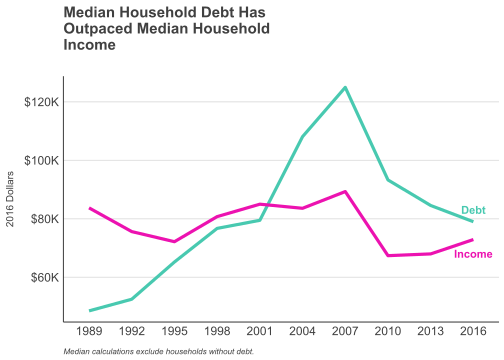
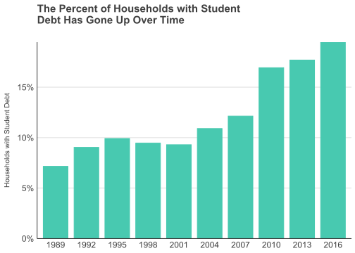
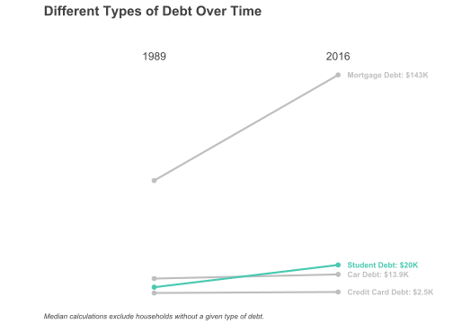
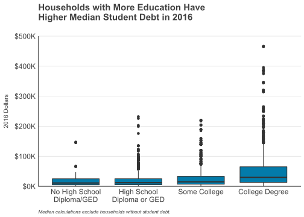
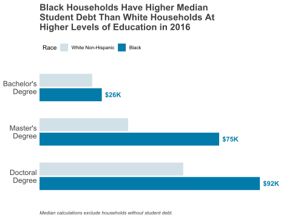
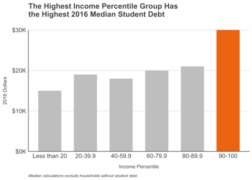
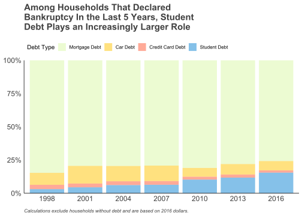
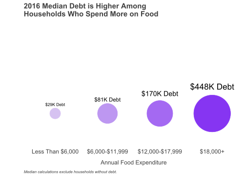

# Setup

Load relevant packages:


```r
library(dplyr)
library(ggplot2)
library(ggthemes)
library(tidyr)
library(readr)
library(janitor)
library(plotly)
library(DT)
library(ggrepel)
library(stringr)
library(RColorBrewer)
```


Import dataset and clean variable names:


```r
debt_data <- read_csv("data/survey_SCF.txt") %>% clean_names()
```

Define a custom theme:


```r
theme_custom <- function () {
  theme_classic(base_size = 10, base_family = "Arial") %+replace%
    theme(
      axis.line = element_line(color = "gray20"),
      axis.ticks = element_blank(),
      axis.title.y = element_text(margin = margin(t = 0, r = 10, b = 0, l = 0), 
                                  angle = 90,
                                  size = 10,
                                  color = "gray25"),
      axis.title.x = element_text(margin = margin(t = 10, r = 0, b = 0, l = 0),
                                  size = 10,
                                  color = "gray25"),
      axis.text = element_text(size = 12, color = "gray25"),
      plot.title = element_text(margin = margin(t = 0, r = 0, b = 25, l = 0), 
                                hjust = 0, 
                                size = 15, 
                                face = "bold",
                                color = "gray25"),
      legend.position = "top",
      legend.justification = "left",
      legend.direction = "horizontal",
      legend.box.margin = margin(t = -10),
      plot.caption = element_text(margin = margin(t = 10),
                                  color = "gray25",
                                  hjust = 0,
                                  size = 8,
                                  face = "italic")
    )
}
```

# Preface

I want to preface this assignment by acknowledging that my charts and visualizations tend to be more minimalistic than not. The goal is to focus on the qualitative aspects and give readers a clear understanding of the big picture ideas. As such, people who want to dig into the details and numbers will likely have a harder time and be a bit disappointed.

# 1. Debt Over Time

The first chart I include to visualize debt over time is a simple double line graph. One line looks at household debt and the other looks at household income. Though simple, the idea is clear: while at one point median income was higher than median debt among households with debt, debt has now surpassed income.


```r
p1_data <-debt_data %>%
  filter(hdebt == 1) %>%
  mutate(year = as.factor(year)) %>%
  group_by(year) %>%
  summarize(median_debt = median(debt)/1000,
            median_inc = median(income)/1000)
  
p1 <- ggplot(p1_data, aes(x = year, y = median_debt, group = 1)) +
  geom_line(size = 1.5, color = "#48C9B0") +
  geom_line(aes(x = year, y = median_inc, group = 1), size = 1.5, color = "#EC12B0") +
  geom_text(data = p1_data %>% filter(year == 2016),
            aes(y = median_debt, label = "Debt"),
            color = "#48C9B0",
            fontface = "bold",
            vjust = -1) + 
  geom_text(data = p1_data %>% filter(year == 2016),
            aes(y = median_inc, label = "Income"),
            color = "#EC12B0",
            fontface = "bold",
            vjust = 2.3) + 
  scale_y_continuous(labels = function(y) paste0("$", y, "K")) +
  labs(title = str_wrap("Median Household Debt Has Outpaced Median Household Income", width = 30),
       y = "2016 Dollars",
       caption = "Median calculations exclude households without debt.") +
  theme_custom() +
  theme(axis.title.x = element_blank(),
        panel.grid.major.y = element_line(color = "gray87"))

p1
```

<!-- -->

This next chart is a simple barchart and is (hopefully) quite straightforward. It should speak to the idea that student debt has become more prevalent and, by extension, more important over time. Readers should have no trouble seeing that the share of households with student debt has increased over time.


```r
p2<- debt_data %>%
  mutate(year = as.factor(year), has_educ_debt = ifelse(edn_inst > 0, 1, 0)) %>%
  group_by(year) %>%
  summarize(pct_debt = mean(has_educ_debt)) %>%
  ggplot(aes(x = year, y = pct_debt)) +
  geom_col(width = 0.8, color = "#48C9B0", fill = "#48C9B0") +
  expand_limits(y = 0) +
  scale_y_continuous(labels = scales::percent_format(accuracy = 1),
                     expand = c(0, 0)) +
  labs(title = str_wrap("The Percent of Households with Student Debt Has Gone Up Over Time", width = 40),
       y = "Households with Student Debt") +
  theme_custom() +
  theme(axis.title.x = element_blank(),
        panel.grid.major.y = element_line(color = "gray87"))

p2
```

<!-- -->

The last chart for this section is my attempt at a slopegraph. I think there are two takeaways here: (1) student debt has gone up since 1989 while this is not necessarily the case for other sources of debt, and (2) student debt is the second highest type of debt in 2016. The color scheme should help readers immediately see and focus on the line for student debt. Unfortunately, the title is a bit weak since I couldn't think of a way to distill everything I wanted to say into a relatively simple line.


```r
slopegraph_data <- debt_data %>%
  filter(hdebt == 1) %>%
  mutate(year = as.factor(year)) %>%
  select(year, edn_inst, nh_mort, veh_inst, ccbal) %>%
  mutate_all(~replace(., . == 0, NA)) %>%
  pivot_longer(-year, names_to = "debt_type", values_to = "amount") %>%
  group_by(year, debt_type) %>%
  summarize(med_debt = median(amount, na.rm = TRUE)/1000) %>%
  filter(year %in% c(1989, 2016)) %>%
  mutate(debt_type = factor(debt_type, 
                            levels = c("edn_inst", "nh_mort", "veh_inst", "ccbal"),
                            labels = c("Student Debt", "Mortgage Debt", "Car Debt", "Credit Card Debt")))

p3 <- ggplot(slopegraph_data %>% filter(debt_type != "Student Debt"), aes(x = year, y = med_debt, group = debt_type)) +
  geom_line(size = 1, color = "gray") +
  geom_point(size = 2, color = "gray") +
  geom_line(slopegraph_data %>% filter(debt_type == "Student Debt"), 
            mapping = aes(x = year, y = med_debt, group = debt_type),
            size = 1,
            color = "#48C9B0") +
  geom_point(slopegraph_data %>% filter(debt_type == "Student Debt"), 
             mapping = aes(x = year, y = med_debt, group = debt_type),
             size = 2,
             color = "#48C9B0") +
  scale_x_discrete(position = "top") +
  geom_text_repel(slopegraph_data %>% filter(year == 2016 & debt_type != "Student Debt"), 
                  mapping = aes(label = paste0(debt_type,": $", med_debt, "K")),
                  hjust = "left",
                  fontface = "bold",
                  size = 3,
                  nudge_x = 0.05,
                  segment.color = NA,
                  color = "gray") +
  geom_text_repel(slopegraph_data %>% filter(year == 2016 & debt_type == "Student Debt"), 
                  mapping = aes(label = paste0(debt_type,": $", med_debt, "K")),
                  hjust = "left",
                  fontface = "bold",
                  size = 3,
                  nudge_x = 0.05,
                  segment.color = NA,
                  color = "#48C9B0") +
  labs(title = str_wrap("Different Types of Debt Over Time", width = 35),
       x = "",
       y = "",
       caption = "Median calculations exclude households without a given type of debt.") +
  theme_custom() +
  theme(legend.position = "none",
        axis.line = element_blank(),
        axis.ticks = element_blank(),
        axis.text.y = element_text(color = "white"))

p3
```

<!-- -->


# 2. Tell Me Who You Are

This first chart is a boxplot and a departure from my more simple and interpretable visualizations. It would not be a stretch to say that I threw this one in for the sake of variety. That said, it's still pretty clear that the households with higher levels of student debt tend to fall in the "College Degree" category.


```r
p4 <- debt_data %>%
  filter(year == 2016 & edn_inst > 0) %>%
  mutate(edn_inst = edn_inst/1000,
         edcl = factor(edcl, 
                       levels = c(1, 2, 3, 4), 
                       labels = c(str_wrap("No High School Diploma/GED", width = 15),
                                  str_wrap("High School Diploma or GED", width = 15),
                                  "Some College",
                                  "College Degree"))) %>%
  ggplot(aes(x = edcl, y = edn_inst)) +
  geom_boxplot(fill =  "#037BAA")  +
  scale_y_continuous(expand = c(0, 0), 
                     limits = c(0, 500),
                     labels = function(y) paste0("$", y, "K")) +
  labs(title = str_wrap("Households with More Education Have Higher Median Student Debt in 2016", 
                        width = 35),
       y = "2016 Dollars",
       caption = "Median calculations exclude households without student debt.") +
  theme_custom() +
  theme(axis.title.x = element_blank(),
        panel.grid.major.y = element_line(color = "gray87"))

p4
```

<!-- -->

It was previously established that households with a college degree have more student debt, and the following horizontal side-by-side bar chart delves into this a little bit more. Here, I compare the student debt of Black households with that of White households across three levels of higher educational attainment: bachelor's degree, master's degree, and doctoral degree. Black households have more debt in every case, and the color scheme and selective inclusion of data points should help drive this point home.


```r
p5_data <- debt_data %>%
  filter(year == 2016 & edn_inst > 0 & educ >= 12 & race <= 2) %>%
  mutate(educ = factor(educ, 
                       levels = c(14, 13, 12), 
                       labels = c(str_wrap("Doctoral Degree", width = 10), 
                                  str_wrap("Master's Degree", width = 10), 
                                  str_wrap("Bachelor's Degree", width = 10))), 
         race = factor(race,
                       levels = c(1, 2), 
                       labels = c("White Non-Hispanic", "Black"))) %>%
  group_by(educ, race) %>%
  summarize(med_debt = median(edn_inst)/1000)

p5 <- ggplot(p5_data, aes(x = educ, y = med_debt, fill = race)) +
  scale_fill_manual(values = c(alpha("#A6C4CF", 0.5), "#037BAA")) +
  geom_col(position = position_dodge2(reverse = TRUE), width = 0.65) +
  scale_y_continuous(expand = c(0,0), limits = c(0, 110)) +
  geom_text(data = p5_data %>% filter(race == "Black"),
            aes(x = educ, y = med_debt, label = paste0("$", med_debt, "K")), 
            position = position_dodge2(reverse = TRUE),
            vjust = 2.0,
            hjust = -0.2,
            color = "#037BAA",
            fontface = "bold") +
  labs(title = str_wrap("Black Households Have Higher Median Student Debt Than White Households At Higher Levels of Education in 2016", width = 40),
       y = "Thousands of 2016 Dollars",
       fill = "Race",
       caption = "Median calculations exclude households without student debt.") +
  coord_flip() +
  theme_custom() +
  theme(axis.title.y = element_blank(),
        legend.key.size = unit(1, "line"),
        axis.title.x = element_blank(),
        axis.text.x = element_blank(),
        axis.line = element_blank())

p5
```

<!-- -->

# 3. Wealth and Income Distribution

I guess I'm getting a little lazy as there's only one visualization for this section. It's a simple bar chart here and the color will draw readers to the highest income percentile group and help get my story across. In case you haven't noticed, I'm a pretty big fan of bars. They're just so versatile and easy to interpret.


```r
p6 <- debt_data %>%
  filter(year == 2016 & edn_inst > 0) %>%
  mutate(inccat = factor(inccat,
                         levels = c(1, 2, 3, 4, 5, 6),
                         labels = c("Less than 20",
                                    "20-39.9",
                                    "40-59.9",
                                    "60-79.9",
                                    "80-89.9",
                                    "90-100"))) %>%
  group_by(inccat) %>%
  summarize(med_debt = median(edn_inst)/1000) %>%
  ggplot(aes(x = inccat, y = med_debt, fill = inccat)) +
  geom_col(width = 0.65) +
  scale_fill_manual(values = c("gray", "gray", "gray", "gray", "gray", "#EC6411")) +
  scale_y_continuous(expand = c(0, 0),
                     labels = function(y) paste0("$", y, "K")) +
  labs(title = str_wrap("The Highest Income Percentile Group Has the Highest 2016 Median Student Debt",
                        width = 40),
       x = "Income Percentile",
       y = "2016 Dollars",
       caption = "Median calculations exclude households without student debt.") +
  theme_custom() +
  theme(panel.grid.major.y = element_line(color = "gray87"),
        legend.position = "None")

p6
```

<!-- -->


# 4. Going Broke

My second to last chart is a 100% stacked bar chart. I don't love these kinds of charts as it can be a bit hard to compare data across the different bars. That said, I wanted to display the composition of total debt over time for households that declared bankruptcy in the last 5 years, and I thought this would be a decent way to do so. Student debt has been strategically positioned at the bottom so that it's easy to see how it occupies a larger portion every year, and so that's easy to compare over time. I guess one plus is that the array of colors look nice (in my opinion).


```r
p7 <- debt_data %>%
  filter(hdebt == 1 & bnkruplast5 == 1) %>%
  mutate(year = as.factor(year)) %>%
  select(year, edn_inst, nh_mort, veh_inst, ccbal) %>%
  pivot_longer(-year, names_to = "debt_type", values_to = "amount") %>%
  mutate(debt_type = factor(debt_type, 
                            levels = c("nh_mort", "veh_inst", "ccbal", "edn_inst"),
                            labels = c("Mortgage Debt", 
                                       "Car Debt", 
                                       "Credit Card Debt", 
                                       "Student Debt"))) %>%
  group_by(year, debt_type) %>%
  summarize(total_debt = sum(amount)) %>%
  ggplot(aes(x = year, y = total_debt, fill = debt_type)) +
  geom_col(position = "fill") +
  scale_y_continuous(expand = c(0, 0),
                     labels = scales::percent_format(accuracy = 1)) +
  scale_fill_manual(values = c(alpha("#DAF7A6", 0.5), alpha("#FFC300", 0.5), alpha("#FF5733", 0.5), "#85C1E9")) +
  labs(title = str_wrap("Among Households That Declared Bankruptcy In the Last 5 Years, 
                        Student Debt Plays an Increasingly Larger Role", 
                        width = 40),
       fill = "Debt Type",
       caption = "Calculations exclude households without debt and are based on 2016 dollars.") +
  theme_custom() + 
  theme(axis.title.x = element_blank(),
        axis.title.y = element_blank(),
        legend.key.size = unit(1, "line"))

p7
```

<!-- -->

Finally, we come to my last chart, and I wanted to try something different here. I wanted to try to visualize something without relying on position to a common scale, so I used color and size. Does this visual put form over function? Maybe. Are there better ways to do this? Absolutely. However, I think the reader can still see the story pretty easily: people who spend more on food have higher median debt.


```r
p8_data <- debt_data %>%
  filter(year == 2016 & hdebt == 1) %>%
  mutate(total_food = foodhome + fooddelv + foodaway,
         food_cat = case_when(
           total_food < 6000 ~ "Less Than $6,000",
           total_food >= 6000 & total_food < 12000 ~ "$6,000-$11,999",
           total_food >= 12000 & total_food < 18000 ~ "$12,000-$17,999",
           total_food >= 18000 ~ "$18,000+"
         ),
         food_cat = factor(food_cat,
                           levels = c("Less Than $6,000",
                                      "$6,000-$11,999",
                                      "$12,000-$17,999",
                                      "$18,000+"))) %>%
  group_by(food_cat) %>%
  summarize(med_debt = median(debt)/1000, total_counts = n())
  
p8 <- ggplot(p8_data, aes(x = food_cat, y = 100)) +
  geom_point(aes(size = med_debt, color = factor(med_debt))) +
  scale_color_manual(values = c("#D6C2F1", "#BD97F1", "#A469F2", "#8635F2")) +
  geom_text_repel(data = p8_data %>% filter(food_cat == "Less Than $6,000"),
                  aes(x = food_cat, 
                      y = 100,
                      label = paste0("$", round(med_debt), "K Debt")),
                  segment.color = NA,
                  direction = "y",
                  hjust = 0.5,
                  vjust = -2.5,
                  size = 3) + 
  geom_text_repel(data = p8_data %>% filter(food_cat == "$6,000-$11,999"),
                  aes(x = food_cat, 
                      y = 100,
                      label = paste0("$", round(med_debt), "K Debt")),
                  segment.color = NA,
                  direction = "y",
                  hjust = 0.5,
                  vjust = -3.0,
                  size = 4) +
  geom_text_repel(data = p8_data %>% filter(food_cat == "$12,000-$17,999"),
                  aes(x = food_cat, 
                      y = 100,
                      label = paste0("$", round(med_debt), "K Debt")),
                  segment.color = NA,
                  direction = "y",
                  hjust = 0.5,
                  vjust = -3.5,
                  size = 5) + 
  geom_text_repel(data = p8_data %>% filter(food_cat == "$18,000+"),
                  aes(x = food_cat, 
                      y = 100,
                      label = paste0("$", round(med_debt), "K Debt")),
                  segment.color = NA,
                  direction = "y",
                  hjust = 0.5,
                  vjust = -4.0,
                  size = 6) + 
  scale_y_continuous(expand = c(0, 0), limits = c(0, 350)) +
  scale_size_continuous(range = c(10, 35)) +
  labs(title = str_wrap("2016 Median Debt is Higher Among Households Who Spend More on Food", width = 40),
       x = "Annual Food Expenditure",
       y = "",
       caption = "Median calculations exclude households without debt.") +
  theme_custom() +
  theme(legend.position = "None",
        axis.line = element_blank(),
        axis.text.x = element_text(size = 12),
        axis.title.x = element_text(size = 12),
        axis.text.y = element_text(color = "white"))

p8
```

<!-- -->


# 5. Make Two Plots Interactive

Adding interactivity to my boxplot and 100% stacked bar chart could be particularly helpful for readers. I believe that these two plots are among the hardest to quickly interpret while hiding a lot of data points that someone might want to see. For the boxplot, the interactivity allows readers to see the different components and values of the boxplot without relying on the y-axis to eyeball numbers. For the 100% stacked bar chart, readers can see total debt values and make accurate comparisons across years for car debt and credit card debt. 

Unfortunately, the titles get a little wonky when I make the plots interactive so I did not include them.


```r
ggplotly(p4) %>% layout(title = FALSE)
```

<!--html_preserve--><div id="htmlwidget-81af7936f42043f0daa2" style="width:672px;height:480px;" class="plotly html-widget"></div>
<script type="application/json" data-for="htmlwidget-81af7936f42043f0daa2">{"x":{"data":[{"x":[3,3,3,3,3,3,3,3,3,3,3,3,3,3,3,3,3,3,3,3,3,3,3,3,3,3,3,3,3,3,3,3,3,3,3,3,3,3,3,3,3,3,3,3,3,3,3,3,3,3,3,3,3,3,3,3,3,3,3,3,3,3,3,3,3,3,3,3,3,3,3,3,3,3,3,3,3,3,3,3,3,3,3,3,3,3,3,3,3,3,3,3,3,3,3,3,3,3,3,3,3,3,3,3,3,3,3,3,3,3,3,3,3,3,3,3,3,3,3,3,3,3,3,3,3,3,3,3,3,3,3,3,3,3,3,3,3,3,3,3,3,3,3,3,3,3,3,3,3,3,3,3,3,3,3,3,3,3,3,3,3,3,3,3,3,3,3,3,3,3,3,3,3,3,3,3,3,3,3,3,3,3,3,3,3,3,3,3,3,3,3,3,3,3,3,3,3,3,3,3,3,3,3,3,3,3,3,3,3,3,3,3,3,3,3,3,3,3,3,3,3,3,3,3,3,3,3,3,3,3,3,3,3,3,3,3,3,3,3,3,3,3,3,3,3,3,3,3,3,3,3,3,3,3,3,3,3,3,3,3,3,3,3,3,3,3,3,3,3,3,3,3,3,3,3,3,3,3,3,3,3,3,3,3,3,3,3,3,3,3,3,3,3,3,3,3,3,3,3,3,3,3,3,3,3,3,3,3,3,3,3,3,3,3,3,3,3,3,3,3,3,3,3,3,3,3,3,3,3,3,3,3,3,3,3,3,3,3,3,3,3,3,3,3,3,3,3,3,3,3,3,3,3,3,3,3,3,3,3,3,3,3,3,3,3,3,3,3,3,3,3,3,3,3,3,3,3,3,3,3,3,3,3,3,3,3,3,3,3,3,3,3,3,3,3,3,3,3,3,3,3,3,3,3,3,3,3,3,3,3,3,3,3,3,3,3,3,3,3,3,3,3,3,3,3,3,3,3,3,3,3,3,3,3,3,3,3,3,3,3,3,3,3,3,3,3,3,3,3,3,3,3,3,3,3,3,3,3,3,3,3,3,3,3,3,3,3,3,3,3,3,3,3,3,3,3,3,3,3,3,3,3,3,3,3,3,3,3,3,3,3,3,3,3,3,3,3,3,3,3,3,3,3,3,3,3,3,3,3,3,3,3,3,3,3,3,3,3,3,3,3,3,3,3,3,3,3,3,3,3,3,3,3,3,3,3,3,3,3,3,3,3,3,3,3,3,3,3,3,3,3,3,3,3,3,3,3,3,3,3,3,3,3,3,3,3,3,3,3,3,3,3,3,3,3,3,3,3,3,3,3,3,3,3,3,3,3,3,3,3,3,3,3,3,3,3,3,3,3,3,3,3,3,3,3,3,3,3,3,3,3,3,3,3,3,3,3,3,3,3,3,3,3,3,3,3,3,3,3,3,3,3,3,3,3,3,3,3,3,3,3,3,3,3,3,3,3,3,3,3,3,3,3,3,3,3,3,3,3,3,3,3,3,3,3,3,3,3,3,3,3,3,3,3,3,3,3,3,3,3,3,3,3,3,3,3,3,3,3,3,3,3,3,3,3,3,3,3,3,3,3,3,3,3,3,3,3,3,3,3,3,3,3,3,3,3,3,3,3,3,3,3,3,3,3,3,3,3,3,3,3,3,3,3,3,3,3,3,3,3,3,3,3,3,3,3,3,3,3,3,3,3,3,3,3,3,3,3,3,3,3,3,3,3,3,3,3,3,3,3,3,3,3,3,3,3,3,3,3,3,3,3,3,3,3,3,3,3,3,3,3,3,3,3,3,3,3,3,3,3,3,3,3,3,3,3,3,3,3,3,3,3,3,3,3,3,3,3,3,3,3,3,3,3,3,3,3,3,3,3,3,3,3,3,3,3,3,3,3,3,3,3,3,3,3,3,3,3,3,3,3,3,3,3,3,3,3,3,3,3,3,3,3,3,3,3,3,3,3,3,3,3,3,3,3,3,3,3,3,3,3,3,3,3,3,3,3,3,3,3,3,3,3,3,3,3,3,3,3,3,3,3,3,3,3,3,3,3,3,3,3,3,3,3,3,3,3,3,3,3,3,3,3,3,3,3,3,3,3,3,3,3,3,3,3,3,3,3,3,3,3,3,3,3,3,3,3,3,3,3,3,3,3,3,3,3,3,3,3,3,3,3,3,3,3,3,3,3,3,3,3,3,3,3,3,3,3,3,3,3,3,3,3,3,3,3,3,3,3,3,3,3,3,3,3,3,3,3,3,3,3,3,3,3,3,3,3,3,3,3,3,3,3,3,3,3,3,3,3,3,3,3,3,3,3,3,3,3,3,3,3,3,3,3,3,3,3,3,3,3,3,3,3,3,3,3,3,3,3,3,3,3,3,3,3,3,3,3,3,3,3,3,3,3,3,3,3,3,3,3,3,3,3,3,3,3,3,3,3,3,3,3,3,3,3,3,3,3,3,3,3,3,3,3,3,3,3,3,3,3,3,3,3,3,3,3,3,3,3,3,3,3,3,3,3,3,3,3,3,3,3,3,3,3,3,3,3,3,3,3,3,3,3,3,3,3,3,3,3,3,3,3,3,3,3,3,3,3,3,3,3,3,3,3,3,3,3,3,3,3,3,3,3,3,3,3,3,3,3,3,3,3,3,3,3,3,3,3,3,3,3,3,3,3,3,3,3,3,3,3,3,3,3,3,3,3,3,3,3,3,3,3,3,3,3,3,3,3,3,3,3,3,3,3,3,3,3,3,3,3,3,3,3,3,3,3,3,3,3,3,3,3,3,3,3,3,3,3,3,3,3,3,3,3,3,3,3,3,3,3,3,3,3,3,3,3,3,3,3,3,3,3,3,3,3,3,3,3,3,3,3,3,3,3,3,3,3,3,3,3,3,3,3,3,3,3,3,3,3,3,3,3,3,3,3,3,3,3,3,3,3,3,3,3,3,3,3,3,3,3,3,3,3,3,3,3,3,3,3,3,3,3,3,3,3,3,3,3,3,3,3,3,3,3,3,3,3,3,3,3,3,3,3,3,3,3,3,3,3,3,3,3,3,3,3,3,3,3,3,3,3,3,3,3,3,3,3,3,3,3,3,3,3,3,3,3,3,3,3,3,3,3,3,3,3,3,3,3,3,3,3,3,3,3,3,3,3,3,3,3,3,3,3,3,3,3,3,3,3,3,3,3,3,3,3,3,3,3,3,3,3,3,3,3,3,3,3,3,3,3,3,3,3,3,3,3,3,3,3,3,3,3,3,3,3,3,3,3,3,3,3,3,3,3,3,3,3,3,3,3,3,3,3,3,3,3,3,3,3,3,3,3,3,3,3,3,3,3,3,3,3,3,3,3,3,3,3,3,3,3,3,3,3,3,3,3,3,3,3,3,3,3,3,3,3,3,3,3,3,3,3,3,3,3,3,3,3,3,3,3,3,3,3,3,3,3,3,3,3,3,3,3,3,3,3,3,3,3,3,3,3,3,3,3,3,3,3,3,3,3,3,3,3,3,3,3,3,3,3,3,3,3,3,3,3,3,3,3,3,3,3,3,3,3,3,3,3,3,3,3,3,3,3,3,3,3,3,3,3,3,3,3,3,3,3,3,3,3,3,3,3,3,3,3,3,3,3,3,3,3,3,3,3,3,3,3,3,3,3,3,3,3,3,3,3,3,3,3,3,3,3,3,3,3,3,3,3,3,3,3,3,3,3,3,3,3,3,3,3,3,3,3,3,3,3,3,3,3,3,3,3,3,3,3,3,3,3,3,3,3,3,3,3,3,3,3,3,3,3,3,3,3,3,3,3,3,3,3,3,3,3,3,3,3,3,3,3,3,3,3,3,3,3,3,3,3,3,3,3,3,3,3,3,3,3,3,3,3,3,3,3,3,3,3,3,3,3,3,3,3,3,3,3,3,3,3,3,3,3,3,3,3,3,3,3,3,3,3,3,3,3,3,3,3,3,3,3,3,3,3,3,3,3,3,3,3,3,3,3,3,3,3,3,3,3,3,3,3,3,3,3,3,3,3,3,3,3,3,3,3,3,3,3,3,3,3,3,3,3,3,3,3,3,3,3,3,3,3,3,3,3,3,3,3,3,3,3,3,3,3,3,3,3,3,3,3,3,3,3,3,3,3,3,3,3,3,3,3,3,3,3,3,3,3,3,3,3,3,3,3,3,3,3,3,3,3,3,3,3,3,3,3,3,3,3,3,3,3,3,3,3,3,3,3,3,3,3,3,3,3,3,3,3,3,3,3,3,3,3,3,3,3,3,3,3,3,3,3,3,3,3,3,3,3,3,3,3,3,3,3,3,3,3,3,3,3,3,3,3,3,3,3,3,3,3,3,3,3,3,3,3,3,3,3,3,3,3,3,3,3,3,3,3,3,3,3,3,3,3,3,3,3,3,3,3,3,3,3,3,3,3,3,3,3,3,3,3,3,3,3,3,3,3,3,3,3,3,3,3,3,3,3,3,3,3,3,3,3,3,3,3,3,3,3,3,3,3,3,3,3,3,3,3,3,3,3,3,3,3,3,3,3,3,3,3,3,3,3,3,3,3,3,3,3,3,3,3,3,3,3,3,3,3,3,3,3,3,3,3,3,3,3,3,3,3,3,3,3,3,3,3,3,3,3,3,3,3,3,3,3,3,3,3,3,3,3,3,3,3,3,3,3,3,3,3,3,3,3,3,3,3,3,3,3,3,3,3,3,3,3,3,3,3,3,3,3,3,3,3,3,3,3,3,3,3,3,3,3,3,3,3,3,3,3,3,3,3,4,4,4,4,4,4,4,4,4,4,4,4,4,4,4,4,4,4,4,4,4,4,4,4,4,4,4,4,4,4,4,4,4,4,4,4,4,4,4,4,4,4,4,4,4,4,4,4,4,4,4,4,4,4,4,4,4,4,4,4,4,4,4,4,4,4,4,4,4,4,4,4,4,4,4,4,4,4,4,4,4,4,4,4,4,4,4,4,4,4,4,4,4,4,4,4,4,4,4,4,4,4,4,4,4,4,4,4,4,4,4,4,4,4,4,4,4,4,4,4,4,4,4,4,4,4,4,4,4,4,4,4,4,4,4,4,4,4,4,4,4,4,4,4,4,4,4,4,4,4,4,4,4,4,4,4,4,4,4,4,4,4,4,4,4,4,4,4,4,4,4,4,4,4,4,4,4,4,4,4,4,4,4,4,4,4,4,4,4,4,4,4,4,4,4,4,4,4,4,4,4,4,4,4,4,4,4,4,4,4,4,4,4,4,4,4,4,4,4,4,4,4,4,4,4,4,4,4,4,4,4,4,4,4,4,4,4,4,4,4,4,4,4,4,4,4,4,4,4,4,4,4,4,4,4,4,4,4,4,4,4,4,4,4,4,4,4,4,4,4,4,4,4,4,4,4,4,4,4,4,4,4,4,4,4,4,4,4,4,4,4,4,4,4,4,4,4,4,4,4,4,4,4,4,4,4,4,4,4,4,4,4,4,4,4,4,4,4,4,4,4,4,4,4,4,4,4,4,4,4,4,4,4,4,4,4,4,4,4,4,4,4,4,4,4,4,4,4,4,4,4,4,4,4,4,4,4,4,4,4,4,4,4,4,4,4,4,4,4,4,4,4,4,4,4,4,4,4,4,4,4,4,4,4,4,4,4,4,4,4,4,4,4,4,4,4,4,4,4,4,4,4,4,4,4,4,4,4,4,4,4,4,4,4,4,4,4,4,4,4,4,4,4,4,4,4,4,4,4,4,4,4,4,4,4,4,4,4,4,4,4,4,4,4,4,4,4,4,4,4,4,4,4,4,4,4,4,4,4,4,4,4,4,4,4,4,4,4,4,4,4,4,4,4,4,4,4,4,4,4,4,4,4,4,4,4,4,4,4,4,4,4,4,4,4,4,4,4,4,4,4,4,4,4,4,4,4,4,4,4,4,4,4,4,4,4,4,4,4,4,4,4,4,4,4,4,4,4,4,4,4,4,4,4,4,4,4,4,4,4,4,4,4,4,4,4,4,4,4,4,4,4,4,4,4,4,4,4,4,4,4,4,4,4,4,4,4,4,4,4,4,4,4,4,4,4,4,4,4,4,4,4,4,4,4,4,4,4,4,4,4,4,4,4,4,4,4,4,4,4,4,4,4,4,4,4,4,4,4,4,4,4,4,4,4,4,4,4,4,4,4,4,4,4,4,4,4,4,4,4,4,4,4,4,4,4,4,4,4,4,4,4,4,4,4,4,4,4,4,4,4,4,4,4,4,4,4,4,4,4,4,4,4,4,4,4,4,4,4,4,4,4,4,4,4,4,4,4,4,4,4,4,4,4,4,4,4,4,4,4,4,4,4,4,4,4,4,4,4,4,4,4,4,4,4,4,4,4,4,4,4,4,4,4,4,4,4,4,4,4,4,4,4,4,4,4,4,4,4,4,4,4,4,4,4,4,4,4,4,4,4,4,4,4,4,4,4,4,4,4,4,4,4,4,4,4,4,4,4,4,4,4,4,4,4,4,4,4,4,4,4,4,4,4,4,4,4,4,4,4,4,4,4,4,4,4,4,4,4,4,4,4,4,4,4,4,4,4,4,4,4,4,4,4,4,4,4,4,4,4,4,4,4,4,4,4,4,4,4,4,4,4,4,4,4,4,4,4,4,4,4,4,4,4,4,4,4,4,4,4,4,4,4,4,4,4,4,4,4,4,4,4,4,4,4,4,4,4,4,4,4,4,4,4,4,4,4,4,4,4,4,4,4,4,4,4,4,4,4,4,4,4,4,4,4,4,4,4,4,4,4,4,4,4,4,4,4,4,4,4,4,4,4,4,4,4,4,4,4,4,4,4,4,4,4,4,4,4,4,4,4,4,4,4,4,4,4,4,4,4,4,4,4,4,4,4,4,4,4,4,4,4,4,4,4,4,4,4,4,4,4,4,4,4,4,4,4,4,4,4,4,4,4,4,4,4,4,4,4,4,4,4,4,4,4,4,4,4,4,4,4,4,4,4,4,4,4,4,4,4,4,4,4,4,4,4,4,4,4,4,4,4,4,4,4,4,4,4,4,4,4,4,4,4,4,4,4,4,4,4,4,4,4,4,4,4,4,4,4,4,4,4,4,4,4,4,4,4,4,4,4,4,4,4,4,4,4,4,4,4,4,4,4,4,4,4,4,4,4,4,4,4,4,4,4,4,4,4,4,4,4,4,4,4,4,4,4,4,4,4,4,4,4,4,4,4,4,4,4,4,4,4,4,4,4,4,4,4,4,4,4,4,4,4,4,4,4,4,4,4,4,4,4,4,4,4,4,4,4,4,4,4,4,4,4,4,4,4,4,4,4,4,4,4,4,4,4,4,4,4,4,4,4,4,4,4,4,4,4,4,4,4,4,4,4,4,4,4,4,4,4,4,4,4,4,4,4,4,4,4,4,4,4,4,4,4,4,4,4,4,4,4,4,4,4,4,4,4,4,4,4,4,4,4,4,4,4,4,4,4,4,4,4,4,4,4,4,4,4,4,4,4,4,4,4,4,4,4,4,4,4,4,4,4,4,4,4,4,4,4,4,4,4,4,4,4,4,4,4,4,4,4,4,4,4,4,4,4,4,4,4,4,4,4,4,4,4,4,4,4,4,4,4,4,4,4,4,4,4,4,4,4,4,4,4,4,4,4,4,4,4,4,4,4,4,4,4,4,4,4,4,4,4,4,4,4,4,4,4,4,4,4,4,4,4,4,4,4,4,4,4,4,4,4,4,4,4,4,4,4,4,4,4,4,4,4,4,4,4,4,4,4,4,4,4,4,4,4,4,4,4,4,4,4,4,4,4,4,4,4,4,4,4,4,4,4,4,4,4,4,4,4,4,4,4,4,4,4,4,4,4,4,4,4,4,4,4,4,4,4,4,4,4,4,4,4,4,4,4,4,4,4,4,4,4,4,4,4,4,4,4,4,4,4,4,4,4,4,4,4,4,4,4,4,4,4,4,4,4,4,4,4,4,4,4,4,4,4,4,4,4,4,4,4,4,4,4,4,4,4,4,4,4,4,4,4,4,4,4,4,4,4,4,4,4,4,4,4,4,4,4,4,4,4,4,4,4,4,4,4,4,4,4,4,4,4,4,4,4,4,4,4,4,4,4,4,4,4,4,4,4,4,4,4,4,4,4,4,4,4,4,4,4,4,4,4,4,4,4,4,4,4,4,4,4,4,4,4,4,4,4,4,4,4,4,4,4,4,4,4,4,4,4,4,4,4,4,4,4,4,4,4,4,4,4,4,4,4,4,4,4,4,4,4,4,4,4,4,4,4,4,4,4,4,4,4,4,4,4,4,4,4,4,4,4,4,4,4,4,4,4,4,4,4,4,4,4,4,4,4,4,4,4,4,4,4,4,4,4,4,4,4,4,4,4,4,4,4,4,4,4,4,4,4,4,4,4,4,4,4,4,4,4,4,4,4,4,4,4,4,4,4,4,4,4,4,4,4,4,4,4,4,4,4,4,4,4,4,4,4,4,4,4,4,4,4,4,4,4,4,4,4,4,4,4,4,4,4,4,4,4,4,4,4,4,4,4,4,4,4,4,4,4,4,4,4,4,4,4,4,4,4,4,4,4,4,4,4,4,4,4,4,4,4,4,4,4,4,4,4,4,4,4,4,4,4,4,4,4,4,4,4,4,4,4,4,4,4,4,4,4,4,4,4,4,4,4,4,4,4,4,4,4,4,4,4,4,4,4,4,4,4,4,4,4,4,4,4,4,4,4,4,4,4,4,4,4,4,4,4,4,4,4,4,4,4,4,4,4,4,4,4,4,4,4,4,4,4,4,4,4,4,4,4,4,4,4,4,4,4,4,4,4,4,4,4,4,4,4,4,4,4,4,4,4,4,4,4,4,4,4,4,4,4,4,4,4,4,4,4,4,4,4,4,4,4,4,4,4,4,4,4,4,4,4,4,4,4,4,4,4,4,4,4,4,4,4,4,4,4,4,4,4,4,4,4,4,4,4,4,4,4,4,4,4,4,4,4,4,4,4,4,4,4,4,4,4,4,4,4,4,4,4,4,4,4,4,4,4,4,4,4,4,4,4,4,4,4,4,4,4,4,4,4,4,4,4,4,4,4,4,4,4,4,4,4,4,4,4,4,4,4,4,4,4,4,4,4,4,4,4,4,4,4,4,4,4,4,4,4,4,4,4,4,4,4,4,4,4,4,4,4,4,4,4,4,4,4,4,4,4,4,4,4,4,4,4,4,4,4,4,4,4,4,4,4,4,4,4,4,4,4,4,4,4,4,4,4,4,4,4,4,4,4,4,4,4,4,4,4,4,4,4,4,4,4,4,4,4,4,4,4,4,4,4,4,4,4,4,4,4,4,4,4,4,4,4,4,4,4,4,4,4,4,4,4,4,4,4,4,4,4,4,4,4,4,4,4,4,4,4,4,4,4,4,4,4,4,4,4,4,4,4,4,4,4,4,4,4,4,4,4,4,4,4,4,4,4,4,4,4,4,4,4,4,4,4,4,4,4,4,4,4,4,4,4,4,4,4,4,4,4,4,4,4,4,4,4,4,4,4,4,4,4,4,4,4,4,4,4,4,4,4,4,4,4,4,4,4,4,4,4,4,4,4,4,4,4,4,4,4,4,4,4,4,4,4,4,4,4,4,4,4,4,4,4,4,4,4,4,4,4,4,4,4,4,4,4,4,4,4,4,4,4,4,4,4,4,4,4,4,4,4,4,4,4,4,4,4,4,4,4,4,4,4,4,4,4,4,4,4,4,4,4,4,4,4,4,4,4,4,4,4,4,4,4,4,4,4,4,4,4,4,4,4,4,4,4,4,4,4,4,4,4,4,4,4,4,4,4,4,4,4,4,4,4,4,4,4,4,4,4,4,4,4,4,4,4,4,4,4,4,4,4,4,4,4,4,4,4,4,4,4,4,4,4,4,4,4,4,4,4,4,4,4,4,4,4,4,4,4,4,4,4,4,4,4,4,4,4,4,4,4,4,4,4,4,4,4,4,4,4,4,4,4,4,4,4,4,4,4,4,4,4,4,4,4,4,4,4,4,4,4,4,4,4,4,4,4,4,4,4,4,4,4,4,4,4,4,4,4,4,4,4,4,4,4,4,4,4,4,4,4,4,4,4,4,4,4,4,4,4,4,4,4,4,4,4,4,4,4,4,4,4,4,4,4,4,4,4,4,4,4,4,4,4,4,4,4,4,4,4,4,4,4,4,4,4,4,4,4,4,4,4,4,4,4,4,4,4,4,4,4,4,4,4,4,4,4,4,4,4,4,4,4,4,4,4,4,4,4,4,4,4,4,4,4,4,4,4,4,4,4,4,4,4,4,4,4,4,4,4,4,4,4,4,4,4,4,4,4,4,4,4,4,4,4,4,4,4,4,4,4,4,4,4,4,4,4,4,4,4,4,4,4,4,4,4,4,4,4,4,4,4,4,4,4,4,4,4,4,4,4,4,4,4,4,4,4,4,4,4,4,4,4,4,4,4,4,4,4,4,4,4,4,4,4,4,4,4,4,4,4,4,4,4,4,4,4,4,4,4,4,4,4,4,4,4,4,4,4,4,4,4,4,4,4,4,4,4,4,4,4,4,4,4,4,4,4,4,4,4,4,4,4,4,4,4,4,4,4,4,4,4,4,4,4,4,4,4,4,4,4,4,4,4,4,4,4,4,4,4,4,4,4,4,4,4,4,4,4,4,4,4,4,4,4,4,4,4,4,4,4,4,4,4,4,4,4,4,4,4,4,4,4,4,4,4,4,4,4,4,4,4,4,4,4,4,4,4,4,4,4,4,4,4,4,4,4,4,4,4,4,4,4,4,4,4,4,4,4,4,4,4,4,4,4,4,4,4,4,4,4,4,4,4,4,4,4,4,4,4,4,4,4,4,4,4,4,4,4,4,4,4,4,4,4,4,4,4,4,4,4,4,4,4,4,4,4,4,4,4,4,2,2,2,2,2,2,2,2,2,2,2,2,2,2,2,2,2,2,2,2,2,2,2,2,2,2,2,2,2,2,2,2,2,2,2,2,2,2,2,2,2,2,2,2,2,2,2,2,2,2,2,2,2,2,2,2,2,2,2,2,2,2,2,2,2,2,2,2,2,2,2,2,2,2,2,2,2,2,2,2,2,2,2,2,2,2,2,2,2,2,2,2,2,2,2,2,2,2,2,2,2,2,2,2,2,2,2,2,2,2,2,2,2,2,2,2,2,2,2,2,2,2,2,2,2,2,2,2,2,2,2,2,2,2,2,2,2,2,2,2,2,2,2,2,2,2,2,2,2,2,2,2,2,2,2,2,2,2,2,2,2,2,2,2,2,2,2,2,2,2,2,2,2,2,2,2,2,2,2,2,2,2,2,2,2,2,2,2,2,2,2,2,2,2,2,2,2,2,2,2,2,2,2,2,2,2,2,2,2,2,2,2,2,2,2,2,2,2,2,2,2,2,2,2,2,2,2,2,2,2,2,2,2,2,2,2,2,2,2,2,2,2,2,2,2,2,2,2,2,2,2,2,2,2,2,2,2,2,2,2,2,2,2,2,2,2,2,2,2,2,2,2,2,2,2,2,2,2,2,2,2,2,2,2,2,2,2,2,2,2,2,2,2,2,2,2,2,2,2,2,2,2,2,2,2,2,2,2,2,2,2,2,2,2,2,2,2,2,2,2,2,2,2,2,2,2,2,2,2,2,2,2,2,2,2,2,2,2,2,2,2,2,2,2,2,2,2,2,2,2,2,2,2,2,2,2,2,2,2,2,2,2,2,2,2,2,2,2,2,2,2,2,2,2,2,2,2,2,2,2,2,2,2,2,2,2,2,2,2,2,2,2,2,2,2,2,2,2,2,2,2,2,2,2,2,2,2,2,2,2,2,2,2,2,2,2,2,2,2,2,2,2,2,2,2,2,2,2,2,2,2,2,2,2,2,2,2,2,2,2,2,2,2,2,2,2,2,2,2,2,2,2,2,2,2,2,2,2,2,2,2,2,2,2,2,2,2,2,2,2,2,2,2,2,2,2,2,2,2,2,2,2,2,2,2,2,2,2,2,2,2,2,2,2,2,2,2,2,2,2,2,2,2,2,2,2,2,2,2,2,2,2,2,2,2,2,2,2,2,2,2,2,2,2,2,2,2,2,2,2,2,2,2,2,2,2,2,2,2,2,2,2,2,2,2,2,2,2,2,2,2,2,2,2,2,2,2,2,2,2,2,2,2,2,2,2,2,2,2,2,2,2,2,2,2,2,2,2,2,2,2,2,2,2,2,2,2,2,2,2,2,2,2,2,2,2,2,2,2,2,2,2,2,2,2,2,2,2,2,2,2,2,2,2,2,2,2,2,2,2,2,2,2,2,2,2,2,2,2,2,2,2,2,2,2,2,2,2,2,2,2,2,2,2,2,2,2,2,2,2,2,2,2,2,2,2,2,2,2,2,2,2,2,2,2,2,2,2,2,2,2,2,2,2,2,2,2,2,2,2,2,2,2,2,2,2,2,2,2,2,2,2,2,2,2,2,2,2,2,2,2,2,2,2,2,2,2,2,2,2,2,2,2,2,2,2,2,2,2,2,2,2,2,2,2,2,2,2,2,2,2,2,2,2,2,2,2,2,2,2,2,2,2,2,2,2,2,2,2,2,2,2,2,2,2,2,2,2,2,2,2,2,2,2,2,2,2,2,2,2,2,2,2,2,2,2,2,2,2,2,2,2,2,2,2,2,2,2,2,2,2,2,2,2,2,2,2,2,2,2,2,2,2,2,2,2,2,2,2,2,2,2,2,2,2,2,2,2,2,2,2,2,2,2,2,2,2,2,2,2,2,2,2,2,2,2,2,2,2,2,2,2,2,2,2,2,2,2,2,2,2,2,2,2,2,2,2,2,2,2,2,2,2,2,2,2,2,2,2,2,2,2,2,2,2,2,2,2,2,2,2,2,2,2,2,2,2,2,2,2,2,2,2,2,2,2,2,2,2,2,2,2,2,2,2,2,2,2,2,2,2,2,2,2,2,2,2,2,2,2,2,2,2,2,2,2,2,2,2,2,2,2,2,2,2,2,2,2,2,2,2,2,2,2,2,2,2,2,2,2,2,2,2,2,2,2,2,2,2,2,2,2,2,2,2,2,2,2,2,2,2,2,2,2,2,2,2,2,2,2,2,2,2,2,2,2,2,2,2,2,2,2,2,2,2,2,2,2,2,2,2,2,2,2,2,2,2,2,2,2,2,2,2,2,2,1,1,1,1,1,1,1,1,1,1,1,1,1,1,1,1,1,1,1,1,1,1,1,1,1,1,1,1,1,1,1,1,1,1,1,1,1,1,1,1,1,1,1,1,1,1,1,1,1,1,1,1,1,1,1,1,1,1,1,1,1,1,1,1,1,1,1,1,1,1,1,1,1,1,1,1,1,1,1,1,1,1,1,1,1,1,1,1,1,1,1,1,1,1,1,1,1,1,1,1,1,1,1,1,1,1,1,1,1,1,1,1,1,1,1,1,1,1,1,1,1,1,1,1,1,1,1,1,1,1,1,1,1,1,1,1,1,1,1,1,1,1,1,1,1,1,1,1,1,1,1,1,1,1,1,1,1,1,1,1,1,1,1,1,1,1,1,1,1,1,1,1,1,1,1,1,1,1,1,1,1,1,1,1,1,1,1,1,1,1,1,1,1,1,1,1,1,1,1,1,1,1,1,1,1],"y":[10,2.5,24,4.7,4.2,25,70,57,57,10,10,10,10,10,25,25,25,25,25,69,69,25,25,12,21.9,21.9,21.9,21.9,21.9,2.9,2.9,3.7,5.5,6.6,11,5,5,5,5,5,2.9,2.9,2.9,2.9,2.5,18,18,30,30,30,30,30,14,12,13,2.5,2.5,152,152,54,54,54,54,54,11,11,20,20,6,6,25,25,25,25,25,18.6,18.6,18.7,18.6,18.6,34,17,22,17,15,21,2.8,4.7,4.7,4.7,4.7,4.7,2,11,3.7,3.7,3.7,3.7,3.7,45,56,56,56,56,56,0.8,0.8,35,35,35,35,35,35,74,76,77,26,26,26,27,20,20,20,20,20,6,6,6,6,6,1.8,1.8,1.8,1.8,1.8,14,15,15,15,12,12,12,7.9,7.9,7.9,7.9,7.9,7,7,35.5,35.5,35.5,35.5,35.5,29,29,29,29,7,44,44,44,44,44,5,24,24,24,24,24,9.7,9.7,220,220,220,18,30,30,20,18,7.5,7.5,7.5,7.5,7.5,40,15,5,5,5,43,43,43,43,43,6,6,19,33,14,14,14,14,14,6.8,21,21,21,21,21,26,26,26,26,26,40,50,50,50,50,24,24,24,24,24,5.4,5.3,8.35,8.35,8.35,8.35,8.35,38,38,38,38,38,1.8,2.2,2.3,1.8,1.8,30,30,38,15,25,9.2,8.4,18,26,25,20,23,31,5.6,5.3,5.6,50,50,48,48,48,48,48,5,25,2,2,2,2,2,1.4,33,33,9,17.1,17.1,17.1,37.2,39.4,39.5,48,58,35,35,35,17,17,17,15,15,15,15,15,3,8,12.1,11.9,11.9,11.9,12.2,14,14,14,9.2,2.5,27,27,27,27,27,1,1,45,16,16,16,16,16,35,35,35,35,35,40.2,15,15,15,11,76.9,76.9,77.9,77.9,76.9,4.5,4.5,4.5,13,7.1,25,25,25,25,25,60,60,19,19,1,1,0.46,19,19,19,19,19,15.2,14.7,15.6,16.2,15.3,42,55,13,13,13,13,13,70,59,10,10,57,52,52,52,52,52,1.8,1.8,1.8,25,25,25,1.2,1.2,1.2,1.2,32,28,30,13,13,13,40,41,41,41,40,8.6,6,7,63.8,62.8,62.8,62.8,62.8,1,2.5,2.5,2.5,2.5,7,7,4.4,4.5,4.4,2.5,4.4,68,0.5,2.5,152,152,9,50,50,50,50,50,7.8,7.8,7.8,7.8,75,75,75,75,75,20,20,20,20,20,60,60,139,139,2.8,139,2.8,2,2,2,2,22,22,11,11,13,13,13,13,13,10,11,11,11,10,4.5,4.5,9,9,9,14.5,14.5,14.5,14.5,14.5,0.43,12,26,26,26,26,25,72,35,40,40,40,40,40,100,7,7,7,7,7,0.51,0.5,0.5,0.5,0.5,40,40,40,40,23.1,10,10,10,10,10,33,33,29,50.2,50.2,50.2,6,12,10,6,6,43,43,43,18,18,18,1.8,1.8,1.8,1.8,1.8,44.5,68,68,68,105,105,0.51,0.5,0.5,0.5,30,30,55.9,55.9,55.9,55.9,55.9,15,15,15,19,19,19,19,33,5,7.3,2.1,2.1,2.1,2.1,2.1,27,7.4,20,20,20,20,20,63,63,5,5,5,5,5,5,50,15,15,15,15,15,9.8,9.8,10.6,10.6,10.6,10.6,10.6,41,41,41,10,10,1.4,1.3,1.9,32.5,32.5,32.5,32.5,32.5,3.4,10,10,10,10,6,6,6,6,6,90,3.5,3.5,3.5,3.5,3.5,15.5,15.5,15.5,15.5,15.5,45,45,45,17,33,33,16,217,33,54.6,54.3,14,7,7,11,19,8.7,13,13,13,13,13,13,7.5,2,2,2,2,2,13.1,105,10,10,0.6,14,35,35,1.2,14,16,16,16,16,16,10,10,10,10,10,0.25,0.25,145,145,65,65,30,30,0.8,28.5,28.5,28.5,28.5,28.5,9,9,9,9,9,6,6,2.5,2.5,2.5,2.5,2.5,28,28,24.7,24.6,23.7,15,15,15,30,1.8,1.8,1.8,1.8,1.8,30,30,30,30,30,7,7,3.6,3.6,0.4,0.4,0.4,59,59,15,15,15,10,10,10,5,5,30,30,30,30,30,46,39,5.1,41,1.2,18.5,18.5,18.5,18.5,18.5,2.9,0.1,6.4,8.6,8.6,8.6,8.6,7,13,6,46,46,46,1,1,46,1,1,15,15,18,18,11,13,10,10,19.3,18,10,6.4,2.5,10,152,11,16,5.5,5.5,5.5,5.5,5.5,154.2,157.1,160.1,158.2,159.2,40,40,40,2.2,8.4,3,17,15,20.1,20.1,20.1,34,100,139,2,2,2,2,29,2,22,22,22,45,23.7,26,26,26,37,37,37,37,37,110,49.9,22.47,22.48,22.47,23.38,22.47,12,12,12,74.2,32,5,5,5,104,105,105,104,104,4,4,10.9,10.9,10.9,10.9,10.8,9.5,9.5,9.5,9.5,9.5,3,3,3,35,5.1,5,5.1,5.1,3.7,3.7,22,22,33,50.2,50.2,54.1,11.2,7,13,9,13,7.5,7.5,7.5,2.3,2.3,2.3,2.3,2.3,30,30,30,30,30,0.91,3,13.9,8.7,220,35,35,6.4,6.4,6.4,6.4,11,11,30.5,30.5,30.5,4.6,4.6,4.6,4.6,4.6,5,5,33,5,4,8,8,8,27,27,27,25,27,17,100,100,100,63,31,36,37,35,15,26,10,10,5,5,46,2.4,2.4,2.4,2.4,2.4,18,92,91,92,91,94,17.5,17.5,6,60,60,60,60,60,10,1.3,20,4,0.85,0.85,0.85,0.85,0.85,42.4,41.5,4.7,5,5,13.7,90,90,90,90,15.7,15.7,41,4,4,4,30,25,1.4,45,45,2.5,45,53.6,2.9,53.7,13,6.4,11.2,11.2,13,8.8,16,36,10,9.4,13,13,13,13,13,1.8,3,3,44.5,5.4,11.7,6.5,19,4.6,34.9,0.6,0.6,0.6,1.2,30,15,15,15,15,15,1,12,38,38,44,44,45,15,14.9,14.9,0.81,0.81,40.1,0.8,0.81,17,25,12,12,12,12,12,1.1,20,26,57.5,28.3,4.5,14,32,23.6,23.6,60,60,19,19,25,1,15,15,9.7,9.7,9.7,9.7,9.7,8,8,8,8,8,26,26,26,26,26,4.5,4.5,25,0.4,45,59,15,2,24,24,24,24,24,39,69,69,69,33,33,12,12,7,16,11,15,13,22,20.4,32,32,2.9,6.4,9,9,16,11.2,204,2.9,204,204,204,11.9,15,15,15,18,7,10,4.5,27,15.7,5.4,8.3,8,8,4.6,4.6,4.6,15,11,11,11,20,20,34,34,34,34,6,25,3.5,3.4,3.5,3.5,3.4,50,50,50,60,34,34,34,6.8,6.7,25,21,2.8,2.8,24,57.5,6,63,57.5,114,11,45,45,9,45,5.3,0.8,0.8,0.8,110,33.9,110,110,35,35,35,4.5,4.5,4.5,0.43,22,73,22,32,27,72,72,5,72,20,20,20,20,20,0.8,0.8,0.8,0.8,0.8,6,6,15.7,47.5,12,5,5,5,5,25,7,7,24.3,33,33,1.4,0.1,32,17,17,10,15,13,17.1,17.1,16,50,50,50,50,5,5,9.7,9.7,9.7,17,220,70,0.91,44.5,5,8.7,11,8,8,1.3,4.6,24,24,5.2,31,40,15,15,24,5,5,6,6,6,20,145,44,4,33,7.4,7.3,7.3,7.3,25,1.6,1.6,6.7,6.8,7.5,7.5,11,11,6,16,20,57.5,5,5,10,45,10,5.4,5.3,5.4,6,6,6,6,10,10,10,10,10,6,120,6,6,6,30,30,30,17,12,20,38,38,38,38,14,17,14,10,5.5,5.9,2,5,5,5,15.7,50,1.8,39,47.5,3,3,50,4,4,1.4,1.4,0.1,16,2.5,13,13,6.4,6.4,7,13,7.5,13,36,13.9,26,26,26,35,35,7.5,17,18,27,3,11.7,11.7,0.92,11.7,0.91,19,68,19,1.3,1.3,0.6,5,8.7,2.5,2.5,1,1,38,38,0.25,0.25,0.25,145,17,17,65,30,40.1,40.2,14.9,40.1,1.6,2.2,25,28,15,11,11,20,57.5,22,20,28,20,20,28,7.1,7.1,60,32,32,32,11,11,11,25,5,1,0.47,0.47,0.46,0.46,83,83,83,26,37,32,28,32,32,10,70,70,70,15,45,14,59,18,57,57,100,2,1.8,12,41,41,47.5,40,35,50,35,3.7,3.7,17.5,50,32,18.4,50,49.9,50,50,50,32,38,185,13,11.2,13,12.1,10.9,46,8,10.9,12.3,70,7,27,70,10,0.91,44.5,5,5,20,12.7,18,105,19,52,12,9,9,8,8,8,8,8,50,50,7.8,41,17,4,24,17,17,60,60,15,3,139,3,17,100,7.5,25,25,63,6,1.1,1.1,28,100,10,28.3,11,114,114,3,3,3,3,3,4.5,3,3,4.5,4.5,5,9,9,0.43,0.42,38,21,22,10,10,2.4,30,5,32,3.6,35,35,14,11,14,14,100,100,20,5,44.5,5,12,21,15.7,35,41,9.5,9.5,49.9,30,33,22,22,2.5,30,4,50,15,15,12,41,7,13.9,36,36,7.5,9.9,8.1,9.9,43,43,7.5,18,7,7.5,1.8,27,10,8.7,18,10,6,12,20,19,105,30,52,6,52,30,5.5,6.1,4,4,3,4,17.5,190,41.5,20,65,4,30,33,25,8,8,17,2.2,10,10,7.5,20,10,1.1,15,25,28,10,10,2,6,28,10,32,12,9.8,9.8,9.8,12,110,11,3,3,30,41,40,41,12,41,7,10,7,30,3.6,21,31,3.6,4.5,4,3.4,11,140,11,10,10,20,18,1.6,13.7,13.7,6,12,34,74,47.5,50,51.8,33,33,51.8,30,2.5,0.1,2.5,12,12,12,140,12,19,25,36.5,40,9,13.9,204,13.9,9,8.1,7.5,50,1.8,5,6,70,70,11.7,10,20,140,2,17,114,18,6,5,5,30,5,30,38,38,38,30,30,50,140,50,6,12,75,7,10,30,14.9,3,20.1,2.2,2.2,3,20,10,10,1.1,28,18,140,10,5.8,140,13.7,14,12,28,23.6,7.1,7.1,19,75,25,8,8,8,30,2.5,54,55,12,51.7,14,145,36.9,15,10,10,10,120,4.5,17,31,0.4,31,42.5,35,4,27,15,20,35,3.4,13.7,3.4,11,73,39,52.8,35,45,25,25,30,3.7,0.1,50,50,30.5,30.5,17.5,24,120,9,9,75,37.2,40,36,9.9,3,25,9.9,10,26,10,1.8,1.8,42.5,36,45,120,34,3.4,140,4,20,15,20,10,23.6,45,45,45,9,15,25,15.3,18,18,12,17.5,5,24,25,25,27.4,24.2,25,3,28,30,20.1,2.2,3,20,20,1.6,5,120,15,25,6.8,22,120,9.5,4,114,14,23.7,17,26,26,8,25,79,77,30,15,2.5,21,15,120,75,75,17,38,47.5,51.8,30,16,140,28,4.5,4,4,45,42.4,20,5.9,17,17,50,5.3,3,30,21,40,4.5,39,56,11,11,12,31,6,16,11,30,3,84,35,7.7,24,19,24,45,6,36.9,6.3,4,21,12,9,120,20,26,5,8.1,0.43,19,45,20,6,20,13.9,28,46,40,28.3,75,14,20,31,9,11,65,9.5,50.1,30,76,17,1,4,4.5,24,17,4,14.9,51.8,20,3,15,11,52,30,21,17,140,40,18,24,4,10,20,30,85,27.5,6.7,12,140,72,20,21,19,59,14.4,28,83,11,9.5,25.7,20.7,25,5,6.6,21,120,189,5,45,57,83,15,14.6,6,9.1,5,4.5,25,45,12,189,6,14,7.8,4,13,28.3,11,14.9,8.1,67,7.3,18,24,9,14,40,50,5.4,4,41,12,30,14,11,4,23.7,4,189,16,15,8,52,7.3,6,189,14,5,30,120,10.9,28.3,9,5,24,30,5,10,26,26,5,30,5,3.9,16,90,6.8,47,17,120,24,26,86,24,167,13,13,97,17,61.9,58,13,165,4.5,24,28,65,148,13,2.2,80,5,28,0.8,165,10,12,148,9.8,65,4,45,4.5,40,30,86,385,4,15,178,20,3,97,2.2,30,39,117,17,8.8,70,15,148,23,23,22,5,26,26,40,0.8,7,40,36,174,4.5,83,219.4,9.1,12,80,13,13,12,12.97,15,40,23,110,15,70,15,110,4,20,13,26,250,10,153,23,19.1,4,49,3,150,19,20,17,30,24,40,170,55,37,4.5,19,52,66,100,120,35,65,59,6.1,110,20,55,55,32,20,30,55,6,4,7.9,108,5.5,65,10,148,30,96,148,41,15,150,150,20,5,65,60,22,170,18,3.8,12.5,6.8,3,3,45,45,80,5,17,23,35,22,15,13,30,15,30,29,110,4,13,45,20,0.8,36,20,5,15.5,4.5,3.4,19,37,4,4,250,16,70,3.5,10,41,23,374.8,3.9,52.3,6,6,28,120,41.5,40,22,64,13,45,30,0.16,104,32,29,6,151,65,22,5,19.2,5,4.5,155,3,38,38,38,4,250,80,6,106,37,12,85,40,39,39,75,19,19,13,15,71,104.2,97,70,9.4,97,22,4.6,4.5,20,86,6,110,15,98,70,35,10,35,37,10,5,23,37,150,5,80.41,10,52,9,0.8,65,9,48,49,22,30,74,38,13,65,103,17,6.4,13,155,12,145,56,0.17,20,184,26,26,185,29,10,11,5,37,4.5,64,8.3,37,21,10,10,99,10,16,171,16,30,395.8,220.6,90,90,89,115,3.9,118,9.9,97,16,2.2,26,145,4.6,45,45,90,20,20,6,20,30,22,26,30.8,3,13,26,31,25,25,148,80,5,28,65,65,6,54,39,82,16,49,75,15,58,120,153,13,36,18,24,15,56,56,0.16,13,20,20,8.9,68,66,87,70.8,8,30,30,70.8,10,10,25,25,5,250,250,40,79,37,49,60,82.5,82.5,32,12,10,10,45,18,36,11.9,155,32,32,68,16,145,6,32,15,8.9,29,87,98,37,8.2,6.9,12,62,115,160,87,22,25,84,3.4,60,170,34,23,80,220.2,2,83,83,221,182,183,28,183,32,65,105.3,9.3,107.3,11.1,11.1,13,7,0.17,265,57,16,7.7,28,4,28,26,96,31,18.9,60,36,46,36,150,36,40,80,40,60,37,10,10,10,100,10,100,62.9,66,2.2,24,65,65,60,64,21,21,63,63,20,30.8,35,28,34,5.7,11,40,70.8,180,70.4,25,37,14,26,16,41,41,28,250,16,86,6,18,9,13.5,5.4,126,40,40,103,89,3.8,50,16,50,2.2,100,21,84,63,104,98,30,4,8.7,8.7,90,8.7,14,26,88,37,2.5,25,3.4,16,99,60,99,30,465,55,30,3.8,7,12.84,12,12.84,12.84,4.1,4.1,15,65,11.1,11.2,15,15,4.6,20,40,20,8.7,130,55,30.8,30.8,30.8,60,60,4,24,35,24,24,46,20,30,28,12,16,23,80.68,11,10,11,57,57,75,57,57,10,13,24,24,12.9,7,4,4,21,5,5,19.5,18.6,120,3,8,7.9,38,30,8,31,23,69,21,10,10,21,20,41,65,65,9,3.5,169,3.5,47,26,47,47,6,82,14.7,9.1,32,0.38,70,70,68,13,15,84,90,98,15,15,34,7.7,8.7,89,37,13,160,16,0.17,25,25,50,48,25,40,48,30,67,65,390.8,53,11.01,11.01,11.01,125,12,51,134,118,107.2,70,385,9.3,20,9.3,30,17,34,35,30,30,55,55,5,35,24,114,163,96,87.5,20,30,25,80.46,80.39,10,80.39,20,51,71,5.4,82,15,82,15,58,20,37,20,17,17,33,17,6,6,0.16,15,40,11,7.9,11,90,11,21,18,5,28.4,28,15,15,48,48,48,19,20,20,103,3.5,82.5,4.5,10,10,10,32,12,14.7,9.1,6,155,70,70,74,80,80,50,145,4,40,16,18.5,42.5,66,18.5,38,49,88,72,16,72,16,160,63,2.5,465,48,36,466,22,22,80,18,22,18,10,18,28,28,13,2.2,36,13,80,7.6,7.4,4.6,80,63,8,8.9,50,104,31,104,104,71,70,96,70,70,70,20,18.9,19.1,11,20,87.5,12,23,37,120,120,120,0.8,84,66,66,66,15,62.9,35,64,64,64,2.5,60,60,60,0.5,0.5,34,20,34,120,43.9,7.5,26,26,110,30,37,110,110,29,10,10,34,33,33,16,6,18,250,250,90,250,79,6,14.7,119,109,89,155,80,128,40,40,50,50,68,4,101,130,68,68,16,16,69,38,19,38,160,5,4.5,25,84,36,465,48,2,2,52.4,52.3,52.3,53.3,68,69,7,7,165,165,165,15,15,15,40,20,45,30,30,315,315,315,315,315,62,62,29,71,62,70,70,70,30,30,38,38,78,73,120,79,60,36,36,36,114,114,114,114,58,200,24,200,8.3,2.5,65,2.5,7,4,60,56,84,90,8,47,38,38,80,22,98,110,14,31,26,176,175,37,37,41.5,41.5,6,41.5,41.5,60,90,39.5,32.5,30.5,37.5,6,65,65,45,128,128,9.8,74,74,32,12,100,46,130,4,133.5,18.5,15,9.3,16,16,8,21,21,24,24,3.4,3.4,40,16,466,7,15.5,15.5,52,260,115,115,115,115,9.2,11.02,12,70,70,70,14,385,14,107.2,40,40,30,30.6,30,30,45,45,234,55,62,31,31,25,25,25,52,25,25,20,12,12,10,106,5,83,32,71,82,52,41,62.9,38,103,50,103,50,50,0.5,17,0.5,6,24,56,120,84,90,38,20,18,16,13,10,6,6,15.5,15.5,15.5,15.5,25,19,19,91,4.5,86,5.6,4.5,5.6,4,69,69,36.5,100,30,30,0.6,30,17,17,145,47,20,20,68,68,20,14,14,15,4,38,72,21,2,19,14,115,8.5,7,16,20,20,20,17,99,99,30,18,61,61,61,220.3,80,80,11,183,95,95,95,95,8,8,8,11,50,30,63,8.9,186,178,19,8.3,8.3,11,3,60,46,46,47,47,148,148,148,5,40,25,40,10,10,19,19,100,50,75,75,66,10,10,10,10,21,60,7,7,19,38,7,120,2.5,26,120,26,2.1,221,180,110,180,16,16,16,42,180,180,33,65,60,5,5,5,12.5,100,250,6,79,3.8,82,3.8,3.8,16,16,14,14,14,17,20,20,17.5,17.5,34,34,133.5,15,133.5,1.9,38,72,75,26,26,84,22,22,40,40,79,79,2,68,68,68,6,6,29,40,40,40,40,40,40,40,13.5,40,22,22,22,22,1.1,1.1,1.1,1.1,3.1,5,4.2,13,13,5,13,13,7.5,5,30,27,27,20,148,10,20,39,6,46,46,46,46,58,50,37,24,50,3.5,3.5,2.5,12.9,46,65,4,7,2.5,65,47,65,65,8,8,8,8,72,72,28,22,8,30,93,85,86,82,94,16,60,90,45,26,27,47,70,70,33,65,65,65,9.8,66,91.2,55.5,74,74,17,102,102,6.8,6.8,6.8,224,133.5,15,320,224,59,59,13,13,26,13,16,16,20,16,16,2,2,23,2,260,50,52,51,90,51,14,14,14,9.3,10,40,9.3,80,13,32,30,17,17,32,35,60,86,55,96,57,57,57,119,145,87.5,87.5,106,52,106,23,5.4,5,5.4,32,29,16,30,12,12,25,15,104,50,120,18,24,6,0.5,84,15,65,19,38,38,18,9,9.1,18,28.5,40,40,55,55,54,55,55,61,61,61,16,6,82.5,8,8,32,100,69,12.5,100,100,30,100,155,80,2.3,13,3.5,13,86,100,100,22,22,46,46,46,224,133.5,224,72,98,98,98,25,13,84,20,25,38,38,30,30,48,22,22,18,18,18,83,83,182,36,36,30,80,80,80,80,5,11.2,8,196,163,8.9,28,50,89,28,89,89,89,60,71,11,11,20,20,14,180,179,179,179,120,25,85,84,100,12,10,57,104,3.5,3.5,200,35,209,65,65,15,15,100,40,40,34,14,19,15,80,80,80,80,221,265,49,64,180,180,41,32,32,32,104,3.5,210,210,210,18,9,26,3,109,89,89,24.1,25,25,25,25,25,70,68,68,16,130,34,15,59,15,223,19,43.5,320,320,8.7,39.5,39.5,0.18,160,35,22,22,35,35,79,79,79,6,12.98,12,30,12,38.3,20.3,101.3,4.1,4.1,4.1,137,22,40,5,5,40,88,88,88,18.5,55,5,5,35,9.2,9.2,22,24,21,25,25,25,25,27,20,36,60,345.9,346.8,344.8,25,10,70,104,62.9,15,103,50,78,200,24,4,78,100,19,254,3,3,65,3,38,38,50,50,38,22,22,72,22,37,8,8,178,163,163,61,61,91,14,90,27,36,5,65,65,65,7,7,14.6,14.7,70,70,70,70,70,60,6.8,6.8,60,10,101,42.5,12,320,2,16,7.5,2.4,2.4,2.4,2.4,5,4.5,2.5,2.5,2.5,30,68,20,377.8,18,65,65,260,260,11.02,9.1,9.1,12,12,385,385,80,80,80,11,11,162,31,30.6,17,17,30,30,30,31,60,73,69,20.5,146,25,52,52,87.5,5,5,106,6,106,5.4,2.1,29,12,2.1,18,18,114,15,33,33,33,20,33,24,2.5,7,254,60,19,38,9.1,43.8,18,9.1,6,28.5,30,15,48,48,25,10,10,180,65,65,65,5.6,4.5,69,4.5,4.5,4,90,32,32,2,17,30,17,2.8,5,5,5,5,5,15,15,15,15,15,36.8,42.6,42.5,15,40,19,4,4,19,16,4,16,34,34,34,36,36,36,30,40,29,29,18,28,61,13,10,30,95,139,136,2.9,137,45,31,31,31,143,165,50,184,31,31,31,31,30,30,8.3,45,30,11,11,14,14,14,33,33,40,84,2.1,33,84,2.1,29,73,71,49,104,12,6.6,2.5,2.5,209,2.5,2.5,18,100,7,43.8,43.9,42.9,80,10,10,10,39,39,110,25,28,8,37,37,50,53,14,14,14,5,44,45,5.6,100,36,12.5,78,3,3,128,128,40,40,40,75,75,74,74,130,11.2,10.6,11.4,10.6,16,14,2,1,21,320,24,24,14,14,24,40,51.2,2,2,51.2,51.2,40,65,65,65,29,20,19,260,7,2.9,136,10,10,10,2.9,145,26,26,159,13.5,31,60,60,60,60,60,62,45,62,62,62,62,70,70,27,38,38,27,60,38,36,5.4,6,2.1,12,210,32,19,19,45,104,57,2.5,107,107,107,20,209,60,60,47,47,80,9.1,47,80,90,90,90,90,22,8,40,180,180,40,32,14.5,14.5,8,14,5.7,4,27,45,6,120,29,36,10,10,10,10,0.6,0.6,0.6,0.6,63.9,35.5,60,60,14,14,1,1,36.8,10,41.8,72,12,12,12,21,14,115,115,7,7,7,15.5,2,20,6.6,6.6,6,120,100,26,11,51,30,10,30,40,52.4,2.9,18,13.5,13.5,13.5,141,1.1,62,30.6,30.6,30.6,45,45,79,76,221,216,215,57,57,126,21.5,13,5.6,23,52,344.3,179,344.8,46,100,120,18,58,43,57,37,49,50,20,35,47,60,11.9,12.9,56,2.5,75,19,2.5,2.2,2.2,28.4,28.5,6,6,15,40,234,50,35,53,53,14.5,14.5,105,82.5,44,8,100,0.7,6,10,90,90,100,100,80,2.8,47,47,2.9,47,75,75,75,75,196,24,24,24,10,22,10,12,26,26,26,3,16,84,20,3,17,17,17,0.7,17,0.7,40,120,120,6,69,25,61,12,30,57,9.1,385,78,200,78,146,143,196,30,100,30,13,30,10,8.3,45,45,8.3,45,30,5,30,14,38,46,47,47,33,38,6,10,8,6,20,15,4,25,25,57,3.8,3.5,3.5,14,14,72,209,82,209,16,12,2.5,8,8,8,26,2.2,2.5,2.5,2.5,40,90,40,40,40,40,50,50.2,50.2,53,6.6,40,33,6.6,15.5,30.5,15,100,100,100,12,16,16,72.4,32.2,39,72,72,72,11,158,12,12,12,22,10,46,2,12,7.5,7.6,7.6,67,7.6,7.6,26,0.18,10,25,6.6,23,6,20,40,30,0.18,15.5,30.5,51,51,38.4,44.8,57,3.5,64,12.84,3.5,197,197,30,40,82,100,11,88,24.5,17.2,9.2,6.4,7,45,5.3,39,215,21,146,10,32,20,5.6,53,20,10,5,39.5,115,30.5,35,15,30,70,70,70,12.97,18,18,12.98,78,30,16,16,16,16,10,10,10,8,8,72,72,50,50,5,35,35,50,35,20,146,30.5,20,0.7,33,38,14,38,30.5,15,30,210,10,33,25,44.9,17,1.5,3.5,12.97,16,11,59,59,7,34,10,15,16,102,7.5,7.5,77,5,15,26,30,59,20,25,50,146,47,146,35,14,98,35,35,4.6,15,28,15,89,24.1,2.8,18,19,86,86,12,17,100,22,15,62,37,35,35,35,60,86,60,45,30,77,16,21.5,82,10,25,38,0.7,35,5,3,35,30,16,77,30,39,82,15,18,10,24.1,207,3.5,207,7,7.5,30,26,16,39,25,3,38,79,11,2.5,30,38.4,142.5,45,2,4.6,30,72,21,33,33,5.6,5.6,35,2,15,29,15,142.5,98,25,37,22,16,24.1,90,208,89,4.7,15,16,17,2.8,16,234,35,220,15,15,24,8,77,4.7,50,2,14,14,107,15,254,39.5,5,3,38,13,45,24.1,1,208,142.5,14,7.6,39.5,254,30,50,3,8,37,4.7,1,5,60,2.8,60,107,0.18,21.5,5.6,68,30,16,45,10,142.5,69,8,8,5,15,15,254,4,8,10.4,10,15,9.2,2.1,10.4,142.5,98,15,21.4,2.4,89,15,35,15,7,45,2.5,10,35,29,82,82,110,15,4,29,29,15,13,37,17,35,10,4.8,77,14.5,86,86,207,10.4,10.4,11,75,13,24,7,29,117,46.1,80,69,69,2,15,88,69,13,17,37,38,12.84,17,10.4,69,10,62,9.2,15,69,62,62,62,38,3.1,29,30,100,14,5.7,2,10,67,19.1,11,27,14,17,8.8,100,27,73,18,18,14,4.5,29,11,90,27,3.2,5.3,1,6,6,17,4.3,4.5,6,6.4,10,17,6.5,100,0.5,67,13,11.8,10,100,2.7,94,6,5.2,3.1,5,11.8,6.5,14,20.1,16,2.7,14,100,14,14,10,10,73,73,6.5,30,76,11.8,100,13,0.78,3.1,15,15,23,5.2,0.79,0.78,6.5,6.5,20,5,29.7,1.6,5,76,15,20,20,0.3,0.3,11,29,5,100,24,0.5,11,18,2.7,20,135,68,5,1.6,1.6,5,10,34.7,3.5,17,19,90,1,1.6,100,18,12,10,11,5,3.5,12,8,18,10,4,15,23,135,11,60.35,5,6,8.4,19,13,2,19.1,6.5,7.2,24,26,89,67,10,10,0.5,50,15,50,30,100,16,203,46,7.4,3,67,29,7,8.4,0.8,1.6,1.6,10,6,18,2.7,11,18,135,6,67,100,9.2,9.2,17,7.5,10,3.7,6.5,45,176,18,1.6,6.7,15,50,26,72,19,8.4,8,17,18,46,45,45,100,6,16,10,68,15,0.5,1,76,1,12,11,11,6,18,7.5,100,6.2,25,8.4,17,7.4,1.8,2.7,16,15,2,11,76,199,50,72,35.1,11.8,5,94,3,35,2.6,18,23,23,21,11,11,31,11,7,2.7,15,13,27,25.5,25.5,25.5,25.5,25.5,73,29,19,0.5,94,5,5,14,11,11,15,4.5,26,21,17,50,60.35,11.8,135,80,25,1.8,23,18,12,10,9,5,6.7,8,15,8,17,18,41,94,94,1.6,6,25,25,25,51,17,2,5,5,1,15,15,26,35,35,3.7,17,72,11,25,60.35,135,26,18,22,10,10,60.35,6,1.6,30,26,20.1,17,7,2.5,2.5,2.5,2.5,2.5,2,2,2,1.4,9.2,3.1,51,51,51,19,6.5,7,76,13,20,9.6,35,3.5,9,35,46,22,3.5,9,35,2.6,2.6,10,67,3,3,2.7,0.8,5.5,50,13,4.5,4.5,10,15.5,15.5,11,90,15,14,14,2,0.79,0.79,5,4,4.4,10,12,15,16,16,15,9.5,72,9,1.8,25,80,4.2,21,2.5,22,6.7,67,11,60,2.7,50,3,41,41,1,1.1,1,23,17,21,25,42,30,51,30,10,5,5,14,6.5,15,15,12,15,15,78,11,26,22,17,9,9,1.8,1.8,1.8,1.8,9,16,50,5.5,20.2,41,8,15,15,21,2.5,21,21,21,13,18,6.6,2,18,30,73,3.4,15,15,73,16,35,30,9.5,9.6,3.5,30,17,9,35,12,11,17,17,21,60.34,15,67,50,41,9,13,8.4,3.9,5.6,87,87,90,90,4,4.4,6.5,6.5,6.5,6.5,30,73,73,35,12,12,12,7,7.1,7.1,15,15,2.5,1,80,45,2.8,2.8,2.8,2.8,21,10,6.7,15,6.7,7.5,7,7,1,31,31,31,31,6,100,100,25,18,18,30,6.5,30,13,73,15,7,5,5,12,12,17,17,49,22,9,10,46,46,49,18,25,15,15,34,5.5,5.5,21,21,2.7,12,2.7,15,58,58,24,3.2,3.3,20,20,20,30,5,3,19,3,7.1,1.5,1.5,9.6,30,30,30,2.5,1,1.7,1.8,1.7,1.7,1.7,1.7,2.6,2.6,6,15,50,18,6.7,3,20,87,4,10,15.5,4,4,0.3,7,73,29,4.3,5,30,30,3,5,5,6.5,13,16,78,78,78,78,16.4,16.4,1.5,60,16.4,1,1,10,20,20,3,20,106,122,119,124,18,117,0.8,0.8,0.8,7.5,63,63,63,30,2,14,9,9,5,15,7,30,12,12,3.5,3.6,10,17,11,49,11,30,30,1.8,30,1.8,18,1.9,20,16,1.9,1.9,17,18,18,8.4,57,57,11,21,47,24,24,10,1.4,1.4,6,28,9,9,9,5,5,5,5,10,10,2.5,3.5,72,232,2.5,12,12,12,3.5,17,6,9,4,37,37,87,7.5,4,4.5,10,87,27,0.3,0.3,7,6,7,29,29,29,30,28,5,3.5,10,10,17,17,17,17,17,25,15,11,16.4,16.4,2.8,45,10,1.8,1.8,3.8,3.8,3.8,3.8,3.8,67,68,107,20,20,20,6,6,6,47,6,63,63,1.6,13,10,10,7,15,1.2,3.5,3.5,3.5,12,10,11,25,226,9,32,27,49,49,3.8,1.9,22,3.8,1.9,16,18,34,34,34,34,15,11,15.5,7,7,3,47,47,7.5,7.5,20,13,13,10,10,10,1.1,1.3,10,25,5,10,10,2.5,28,1,2.5,1.8,1.8,12,3.5,6,6,13,37,20,20,20,4,3,20,15.5,3,3,3,16,6,14,4.3,4.3,34,29,3,13,7,1.1,10,16,3.8,12,12,12,12,3.5,9.1,30,9,1,1,30,10,20,80,80,25,5.5,9,14,10.4,8.7,9.6,23,1,1.5,1.5,3.5,58,26,14,14,25,28,28,3,10,7,1,1.8,1.8,3.5,2.5,2.5,12,7.1,68,2.5,25,15,2.7,20,1.5,25,3.9,3.8,16,7.1,2.6,10,68,68,10,1.4,15,15,20,25,25,3,26,3.5,2.5,7.5,7.5,4,10,10,9,3,62,35,25,25,6,6,6,4.6,32.1,1.4,13,13,3,1.3,10,13,37,100,9.2,9.2,28,15,15,15,10,89,20,25,8,3.5,11,10,90,20,26,15,17,90,47,62,90,9,11,13,7.1,10,26,37,10,7.1,25,13,11,62,7.1,10,10,62,17,62,20,25,15,3,20,0.72,0.88,3,12,3,15,3.2,10,11,10,9,25,5.8,25,35,10,35,0.89,3.2,9,25,3.2,25,12,12,3.2,10,5.8,0.89,2,11,1.7,35,12,25,5.8,5.7,35,6.5,2.9,48,48,48,48,3,12,9,7.5,9,6.5,6.5,3,9,18,18,2.1,1.1,1.1,1.1,20,11,6.5,6.5,35,40,3.2,0.71,9,4,4,0.89,0.88,1.1,6,11,11,5.8,9,18,48,25,25,25,15,15,15,1.1,20,20,40,40,0.72,15,15,15,146.62,18,18,12,12,12,12,0.72,0.72,15,7.5,20,20,20,20,4,4,12,6.8,6.8,7.5,40,7.5,6.8,25,10,43,43,43,43,43,46,46,46,7.5,46,145.42,145.22,146.82,147.02,66.4,15,1.3,1.5,6,6,6,6,4.5,4.5,4.5,4.5,4.5,9,9,20,2,2,2,2,10,9.9,6.8,6.8,26,26,26,26,26,25,25,25,25,25,46,40,66.4,65.4,66.4,66.4,3.9,3.9,3.9,3.9,3.9,5,5,5,5,5,13,12,14,14,12,9,4,9.2,9.2,10,38,38,38,38,38],"hoverinfo":"y","type":"box","fillcolor":"rgba(3,123,170,1)","marker":{"opacity":null,"outliercolor":"rgba(0,0,0,1)","line":{"width":1.88976377952756,"color":"rgba(0,0,0,1)"},"size":5.66929133858268},"line":{"color":"rgba(51,51,51,1)","width":1.88976377952756},"showlegend":false,"xaxis":"x","yaxis":"y","frame":null}],"layout":{"margin":{"t":45.2237442922374,"r":6.6417600664176,"b":28.5595682855957,"l":63.0967206309672},"plot_bgcolor":"rgba(255,255,255,1)","paper_bgcolor":"rgba(255,255,255,1)","font":{"color":"rgba(0,0,0,1)","family":"Arial","size":13.2835201328352},"title":false,"xaxis":{"domain":[0,1],"automargin":true,"type":"linear","autorange":false,"range":[0.4,4.6],"tickmode":"array","ticktext":["No High School<br />Diploma/GED","High School<br />Diploma or GED","Some College","College Degree"],"tickvals":[1,2,3,4],"categoryorder":"array","categoryarray":["No High School<br />Diploma/GED","High School<br />Diploma or GED","Some College","College Degree"],"nticks":null,"ticks":"","tickcolor":null,"ticklen":3.3208800332088,"tickwidth":0,"showticklabels":true,"tickfont":{"color":"rgba(64,64,64,1)","family":"Arial","size":15.9402241594022},"tickangle":-0,"showline":true,"linecolor":"rgba(51,51,51,1)","linewidth":0.603796369674327,"showgrid":false,"gridcolor":null,"gridwidth":0,"zeroline":false,"anchor":"y","title":{"text":"","font":{"color":null,"family":null,"size":0}},"hoverformat":".2f"},"yaxis":{"domain":[0,1],"automargin":true,"type":"linear","autorange":false,"range":[0,500],"tickmode":"array","ticktext":["$0K","$100K","$200K","$300K","$400K","$500K"],"tickvals":[0,100,200,300,400,500],"categoryorder":"array","categoryarray":["$0K","$100K","$200K","$300K","$400K","$500K"],"nticks":null,"ticks":"","tickcolor":null,"ticklen":3.3208800332088,"tickwidth":0,"showticklabels":true,"tickfont":{"color":"rgba(64,64,64,1)","family":"Arial","size":15.9402241594022},"tickangle":-0,"showline":true,"linecolor":"rgba(51,51,51,1)","linewidth":0.603796369674327,"showgrid":true,"gridcolor":"rgba(222,222,222,1)","gridwidth":0,"zeroline":false,"anchor":"x","title":{"text":"2016 Dollars","font":{"color":"rgba(64,64,64,1)","family":"Arial","size":13.2835201328352}},"hoverformat":".2f"},"shapes":[{"type":"rect","fillcolor":null,"line":{"color":null,"width":0,"linetype":[]},"yref":"paper","xref":"paper","x0":0,"x1":1,"y0":0,"y1":1}],"showlegend":false,"legend":{"bgcolor":"rgba(255,255,255,1)","bordercolor":"transparent","borderwidth":1.71796707229778,"font":{"color":"rgba(0,0,0,1)","family":"Arial","size":10.6268161062682}},"hovermode":"closest","barmode":"relative"},"config":{"doubleClick":"reset","showSendToCloud":false},"source":"A","attrs":{"3b9c53cf79de":{"x":{},"y":{},"type":"box"}},"cur_data":"3b9c53cf79de","visdat":{"3b9c53cf79de":["function (y) ","x"]},"highlight":{"on":"plotly_click","persistent":false,"dynamic":false,"selectize":false,"opacityDim":0.2,"selected":{"opacity":1},"debounce":0},"shinyEvents":["plotly_hover","plotly_click","plotly_selected","plotly_relayout","plotly_brushed","plotly_brushing","plotly_clickannotation","plotly_doubleclick","plotly_deselect","plotly_afterplot","plotly_sunburstclick"],"base_url":"https://plot.ly"},"evals":[],"jsHooks":[]}</script><!--/html_preserve-->


```r
ggplotly(p7) %>%
  layout(legend = list(orientation = "h", y = 1.1 , x = 0),
         title = FALSE)
```

<!--html_preserve--><div id="htmlwidget-913e0dc0973f9babeac2" style="width:672px;height:480px;" class="plotly html-widget"></div>
<script type="application/json" data-for="htmlwidget-913e0dc0973f9babeac2">{"x":{"data":[{"orientation":"v","width":[0.9,0.9,0.9,0.9,0.9,0.9,0.9],"base":[0.153539064144222,0.206239159576553,0.205499879349384,0.207824717664321,0.190638450869387,0.220036302379569,0.242478919248849],"x":[1,2,3,4,5,6,7],"y":[0.846460935855778,0.793760840423447,0.794500120650616,0.792175282335679,0.809361549130613,0.779963697620431,0.757521080751151],"text":["year: 1998<br />total_debt: 39114765<br />debt_type: Mortgage Debt","year: 2001<br />total_debt: 30062247<br />debt_type: Mortgage Debt","year: 2004<br />total_debt: 43746376<br />debt_type: Mortgage Debt","year: 2007<br />total_debt: 35910393<br />debt_type: Mortgage Debt","year: 2010<br />total_debt: 66869074<br />debt_type: Mortgage Debt","year: 2013<br />total_debt: 67527972<br />debt_type: Mortgage Debt","year: 2016<br />total_debt: 49792300<br />debt_type: Mortgage Debt"],"type":"bar","marker":{"autocolorscale":false,"color":"rgba(218,247,166,0.502)","line":{"width":1.88976377952756,"color":"transparent"}},"name":"Mortgage Debt","legendgroup":"Mortgage Debt","showlegend":true,"xaxis":"x","yaxis":"y","hoverinfo":"text","frame":null},{"orientation":"v","width":[0.9,0.9,0.9,0.9,0.9,0.9,0.9],"base":[0.0633562615717641,0.0730298866633048,0.0900780879811302,0.091588609041455,0.124608395183575,0.140826592625898,0.17214103389929],"x":[1,2,3,4,5,6,7],"y":[0.0901828025724583,0.133209272913248,0.115421791368254,0.116236108622866,0.0660300556858115,0.0792097097536706,0.0703378853495588],"text":["year: 1998<br />total_debt:  4167327<br />debt_type: Car Debt","year: 2001<br />total_debt:  5045059<br />debt_type: Car Debt","year: 2004<br />total_debt:  6355298<br />debt_type: Car Debt","year: 2007<br />total_debt:  5269142<br />debt_type: Car Debt","year: 2010<br />total_debt:  5455372<br />debt_type: Car Debt","year: 2013<br />total_debt:  6857846<br />debt_type: Car Debt","year: 2016<br />total_debt:  4623350<br />debt_type: Car Debt"],"type":"bar","marker":{"autocolorscale":false,"color":"rgba(255,195,0,0.502)","line":{"width":1.88976377952756,"color":"transparent"}},"name":"Car Debt","legendgroup":"Car Debt","showlegend":true,"xaxis":"x","yaxis":"y","hoverinfo":"text","frame":null},{"orientation":"v","width":[0.9,0.9,0.9,0.9,0.9,0.9,0.9],"base":[0.0308308612653983,0.0446902315428653,0.0617326305180427,0.0638102426843054,0.102854219264907,0.117593305303578,0.155250417689909],"x":[1,2,3,4,5,6,7],"y":[0.0325254003063658,0.0283396551204395,0.0283454574630875,0.0277783663571495,0.0217541759186685,0.0232332873223205,0.0168906162093808],"text":["year: 1998<br />total_debt:  1502991<br />debt_type: Credit Card Debt","year: 2001<br />total_debt:  1073313<br />debt_type: Credit Card Debt","year: 2004<br />total_debt:  1560744<br />debt_type: Credit Card Debt","year: 2007<br />total_debt:  1259231<br />debt_type: Credit Card Debt","year: 2010<br />total_debt:  1797320<br />debt_type: Credit Card Debt","year: 2013<br />total_debt:  2011500<br />debt_type: Credit Card Debt","year: 2016<br />total_debt:  1110230<br />debt_type: Credit Card Debt"],"type":"bar","marker":{"autocolorscale":false,"color":"rgba(255,87,51,0.502)","line":{"width":1.88976377952756,"color":"transparent"}},"name":"Credit Card Debt","legendgroup":"Credit Card Debt","showlegend":true,"xaxis":"x","yaxis":"y","hoverinfo":"text","frame":null},{"orientation":"v","width":[0.9,0.9,0.9,0.9,0.9,0.9,0.9],"base":[0,0,0,0,0,0,0],"x":[1,2,3,4,5,6,7],"y":[0.0308308612653983,0.0446902315428653,0.0617326305180427,0.0638102426843054,0.102854219264907,0.117593305303578,0.155250417689909],"text":["year: 1998<br />total_debt:  1424687<br />debt_type: Student Debt","year: 2001<br />total_debt:  1692561<br />debt_type: Student Debt","year: 2004<br />total_debt:  3399092<br />debt_type: Student Debt","year: 2007<br />total_debt:  2892606<br />debt_type: Student Debt","year: 2010<br />total_debt:  8497768<br />debt_type: Student Debt","year: 2013<br />total_debt: 10181035<br />debt_type: Student Debt","year: 2016<br />total_debt: 10204700<br />debt_type: Student Debt"],"type":"bar","marker":{"autocolorscale":false,"color":"rgba(133,193,233,1)","line":{"width":1.88976377952756,"color":"transparent"}},"name":"Student Debt","legendgroup":"Student Debt","showlegend":true,"xaxis":"x","yaxis":"y","hoverinfo":"text","frame":null}],"layout":{"margin":{"t":45.2237442922374,"r":6.6417600664176,"b":28.5595682855957,"l":41.8430884184309},"plot_bgcolor":"rgba(255,255,255,1)","paper_bgcolor":"rgba(255,255,255,1)","font":{"color":"rgba(0,0,0,1)","family":"Arial","size":13.2835201328352},"title":false,"xaxis":{"domain":[0,1],"automargin":true,"type":"linear","autorange":false,"range":[0.4,7.6],"tickmode":"array","ticktext":["1998","2001","2004","2007","2010","2013","2016"],"tickvals":[1,2,3,4,5,6,7],"categoryorder":"array","categoryarray":["1998","2001","2004","2007","2010","2013","2016"],"nticks":null,"ticks":"","tickcolor":null,"ticklen":3.3208800332088,"tickwidth":0,"showticklabels":true,"tickfont":{"color":"rgba(64,64,64,1)","family":"Arial","size":15.9402241594022},"tickangle":-0,"showline":true,"linecolor":"rgba(51,51,51,1)","linewidth":0.603796369674327,"showgrid":false,"gridcolor":null,"gridwidth":0,"zeroline":false,"anchor":"y","title":{"text":"","font":{"color":null,"family":null,"size":0}},"hoverformat":".2f"},"yaxis":{"domain":[0,1],"automargin":true,"type":"linear","autorange":false,"range":[0,1],"tickmode":"array","ticktext":["0%","25%","50%","75%","100%"],"tickvals":[0,0.25,0.5,0.75,1],"categoryorder":"array","categoryarray":["0%","25%","50%","75%","100%"],"nticks":null,"ticks":"","tickcolor":null,"ticklen":3.3208800332088,"tickwidth":0,"showticklabels":true,"tickfont":{"color":"rgba(64,64,64,1)","family":"Arial","size":15.9402241594022},"tickangle":-0,"showline":true,"linecolor":"rgba(51,51,51,1)","linewidth":0.603796369674327,"showgrid":false,"gridcolor":null,"gridwidth":0,"zeroline":false,"anchor":"x","title":{"text":"","font":{"color":null,"family":null,"size":0}},"hoverformat":".2f"},"shapes":[{"type":"rect","fillcolor":null,"line":{"color":null,"width":0,"linetype":[]},"yref":"paper","xref":"paper","x0":0,"x1":1,"y0":0,"y1":1}],"showlegend":true,"legend":{"bgcolor":"rgba(255,255,255,1)","bordercolor":"transparent","borderwidth":1.71796707229778,"font":{"color":"rgba(0,0,0,1)","family":"Arial","size":10.6268161062682},"y":1.1,"orientation":"h","x":0},"annotations":[{"text":"Debt Type","x":1.02,"y":1,"showarrow":false,"ax":0,"ay":0,"font":{"color":"rgba(0,0,0,1)","family":"Arial","size":13.2835201328352},"xref":"paper","yref":"paper","textangle":-0,"xanchor":"left","yanchor":"bottom","legendTitle":true}],"hovermode":"closest","barmode":"relative"},"config":{"doubleClick":"reset","showSendToCloud":false},"source":"A","attrs":{"3b9cb7953f5":{"x":{},"y":{},"fill":{},"type":"bar"}},"cur_data":"3b9cb7953f5","visdat":{"3b9cb7953f5":["function (y) ","x"]},"highlight":{"on":"plotly_click","persistent":false,"dynamic":false,"selectize":false,"opacityDim":0.2,"selected":{"opacity":1},"debounce":0},"shinyEvents":["plotly_hover","plotly_click","plotly_selected","plotly_relayout","plotly_brushed","plotly_brushing","plotly_clickannotation","plotly_doubleclick","plotly_deselect","plotly_afterplot","plotly_sunburstclick"],"base_url":"https://plot.ly"},"evals":[],"jsHooks":[]}</script><!--/html_preserve-->

# 6. Data Table

I would like to include a data table with information on median debt by year, highest degree earned, and race. I believe that the intersection of race, education, and debt is an interesting and persistently relevant topic in today's U.S. political climate. I also believe that this is data that people would want to explore more in detail. Only higher levels of educational attainment are included (bachelor's, master's, doctoral).


```r
debt_data %>%
  filter(edn_inst > 0 & educ >= 12) %>%
  mutate(educ = factor(educ, 
                       levels = c(14, 13, 12), 
                       labels = c("Doctoral Degree", 
                                  "Master's Degree", 
                                  "Bachelor's Degree")), 
         race = factor(race,
                       levels = c(1, 2, 3, 5), 
                       labels = c("White Non-Hispanic", "Black", "Hispanic", "Other"))) %>%
  group_by(year, educ, race) %>%
  summarize(med_debt = round(median(edn_inst), 2)) %>%
  arrange(year, educ, race) %>%
  datatable(
    rownames = FALSE,
    colnames = c("Year", "Highest Degree Earned", "Race", "Median Debt"),
    filter = "top",
    options = list(columnDefs = list(list(className = 'dt-center', targets = "_all")))
  )
```

<!--html_preserve--><div id="htmlwidget-83810de97d186db274bc" style="width:100%;height:auto;" class="datatables html-widget"></div>
<script type="application/json" data-for="htmlwidget-83810de97d186db274bc">{"x":{"filter":"top","filterHTML":"<tr>\n  <td data-type=\"number\" style=\"vertical-align: top;\">\n    <div class=\"form-group has-feedback\" style=\"margin-bottom: auto;\">\n      <input type=\"search\" placeholder=\"All\" class=\"form-control\" style=\"width: 100%;\"/>\n      <span class=\"glyphicon glyphicon-remove-circle form-control-feedback\"><\/span>\n    <\/div>\n    <div style=\"display: none; position: absolute; width: 200px;\">\n      <div data-min=\"1989\" data-max=\"2016\"><\/div>\n      <span style=\"float: left;\"><\/span>\n      <span style=\"float: right;\"><\/span>\n    <\/div>\n  <\/td>\n  <td data-type=\"factor\" style=\"vertical-align: top;\">\n    <div class=\"form-group has-feedback\" style=\"margin-bottom: auto;\">\n      <input type=\"search\" placeholder=\"All\" class=\"form-control\" style=\"width: 100%;\"/>\n      <span class=\"glyphicon glyphicon-remove-circle form-control-feedback\"><\/span>\n    <\/div>\n    <div style=\"width: 100%; display: none;\">\n      <select multiple=\"multiple\" style=\"width: 100%;\" data-options=\"[&quot;Doctoral Degree&quot;,&quot;Master&#39;s Degree&quot;,&quot;Bachelor&#39;s Degree&quot;]\"><\/select>\n    <\/div>\n  <\/td>\n  <td data-type=\"factor\" style=\"vertical-align: top;\">\n    <div class=\"form-group has-feedback\" style=\"margin-bottom: auto;\">\n      <input type=\"search\" placeholder=\"All\" class=\"form-control\" style=\"width: 100%;\"/>\n      <span class=\"glyphicon glyphicon-remove-circle form-control-feedback\"><\/span>\n    <\/div>\n    <div style=\"width: 100%; display: none;\">\n      <select multiple=\"multiple\" style=\"width: 100%;\" data-options=\"[&quot;White Non-Hispanic&quot;,&quot;Black&quot;,&quot;Hispanic&quot;,&quot;Other&quot;]\"><\/select>\n    <\/div>\n  <\/td>\n  <td data-type=\"number\" style=\"vertical-align: top;\">\n    <div class=\"form-group has-feedback\" style=\"margin-bottom: auto;\">\n      <input type=\"search\" placeholder=\"All\" class=\"form-control\" style=\"width: 100%;\"/>\n      <span class=\"glyphicon glyphicon-remove-circle form-control-feedback\"><\/span>\n    <\/div>\n    <div style=\"display: none; position: absolute; width: 200px;\">\n      <div data-min=\"442.64\" data-max=\"277990.18\" data-scale=\"2\"><\/div>\n      <span style=\"float: left;\"><\/span>\n      <span style=\"float: right;\"><\/span>\n    <\/div>\n  <\/td>\n<\/tr>","data":[[1989,1989,1989,1989,1989,1989,1989,1989,1989,1992,1992,1992,1992,1992,1992,1992,1992,1992,1992,1995,1995,1995,1995,1995,1995,1995,1995,1995,1995,1995,1998,1998,1998,1998,1998,1998,1998,1998,1998,1998,1998,1998,2001,2001,2001,2001,2001,2001,2001,2001,2001,2001,2001,2004,2004,2004,2004,2004,2004,2004,2004,2004,2004,2007,2007,2007,2007,2007,2007,2007,2007,2007,2007,2007,2007,2010,2010,2010,2010,2010,2010,2010,2010,2010,2010,2010,2010,2013,2013,2013,2013,2013,2013,2013,2013,2013,2013,2013,2013,2016,2016,2016,2016,2016,2016,2016,2016,2016,2016,2016,2016],["Doctoral Degree","Doctoral Degree","Doctoral Degree","Master's Degree","Master's Degree","Bachelor's Degree","Bachelor's Degree","Bachelor's Degree","Bachelor's Degree","Doctoral Degree","Doctoral Degree","Doctoral Degree","Master's Degree","Master's Degree","Master's Degree","Bachelor's Degree","Bachelor's Degree","Bachelor's Degree","Bachelor's Degree","Doctoral Degree","Doctoral Degree","Doctoral Degree","Doctoral Degree","Master's Degree","Master's Degree","Master's Degree","Bachelor's Degree","Bachelor's Degree","Bachelor's Degree","Bachelor's Degree","Doctoral Degree","Doctoral Degree","Doctoral Degree","Doctoral Degree","Master's Degree","Master's Degree","Master's Degree","Master's Degree","Bachelor's Degree","Bachelor's Degree","Bachelor's Degree","Bachelor's Degree","Doctoral Degree","Doctoral Degree","Doctoral Degree","Master's Degree","Master's Degree","Master's Degree","Master's Degree","Bachelor's Degree","Bachelor's Degree","Bachelor's Degree","Bachelor's Degree","Doctoral Degree","Doctoral Degree","Doctoral Degree","Master's Degree","Master's Degree","Master's Degree","Bachelor's Degree","Bachelor's Degree","Bachelor's Degree","Bachelor's Degree","Doctoral Degree","Doctoral Degree","Doctoral Degree","Doctoral Degree","Master's Degree","Master's Degree","Master's Degree","Master's Degree","Bachelor's Degree","Bachelor's Degree","Bachelor's Degree","Bachelor's Degree","Doctoral Degree","Doctoral Degree","Doctoral Degree","Doctoral Degree","Master's Degree","Master's Degree","Master's Degree","Master's Degree","Bachelor's Degree","Bachelor's Degree","Bachelor's Degree","Bachelor's Degree","Doctoral Degree","Doctoral Degree","Doctoral Degree","Doctoral Degree","Master's Degree","Master's Degree","Master's Degree","Master's Degree","Bachelor's Degree","Bachelor's Degree","Bachelor's Degree","Bachelor's Degree","Doctoral Degree","Doctoral Degree","Doctoral Degree","Doctoral Degree","Master's Degree","Master's Degree","Master's Degree","Master's Degree","Bachelor's Degree","Bachelor's Degree","Bachelor's Degree","Bachelor's Degree"],["White Non-Hispanic","Black","Hispanic","White Non-Hispanic","Black","White Non-Hispanic","Black","Hispanic","Other","White Non-Hispanic","Black","Other","White Non-Hispanic","Black","Other","White Non-Hispanic","Black","Hispanic","Other","White Non-Hispanic","Black","Hispanic","Other","White Non-Hispanic","Black","Other","White Non-Hispanic","Black","Hispanic","Other","White Non-Hispanic","Black","Hispanic","Other","White Non-Hispanic","Black","Hispanic","Other","White Non-Hispanic","Black","Hispanic","Other","White Non-Hispanic","Black","Other","White Non-Hispanic","Black","Hispanic","Other","White Non-Hispanic","Black","Hispanic","Other","White Non-Hispanic","Black","Other","White Non-Hispanic","Black","Other","White Non-Hispanic","Black","Hispanic","Other","White Non-Hispanic","Black","Hispanic","Other","White Non-Hispanic","Black","Hispanic","Other","White Non-Hispanic","Black","Hispanic","Other","White Non-Hispanic","Black","Hispanic","Other","White Non-Hispanic","Black","Hispanic","Other","White Non-Hispanic","Black","Hispanic","Other","White Non-Hispanic","Black","Hispanic","Other","White Non-Hispanic","Black","Hispanic","Other","White Non-Hispanic","Black","Hispanic","Other","White Non-Hispanic","Black","Hispanic","Other","White Non-Hispanic","Black","Hispanic","Other","White Non-Hispanic","Black","Hispanic","Other"],[18658.6,1959.15,14926.88,5597.58,2472.26,5597.58,6157.34,14926.88,14926.88,11907.19,16267.57,24736.76,7043.69,10733.24,4863.5,6540.57,8351.8,7211.4,5198.91,13937.44,46980.13,15660.04,159732.45,7830.02,7830.02,11823.33,7360.22,5481.02,9396.03,17492.27,20612.14,96642.47,53116.47,10328.2,21836.77,442.64,35410.98,29140.29,14754.58,19918.68,11508.57,8852.75,46064.94,140904.51,54600.5,14564.65,10838.81,40645.54,23709.9,13887.23,6774.26,12193.66,37935.83,33066.33,83556.08,61681.43,22892.08,34338.11,8902.47,17804.95,16278.81,37517.57,11763.99,42846.56,15401.6,22002.29,19686.26,26634.35,46320.6,30108.39,10480.03,19049.35,22581.29,28950.38,22581.29,63003.74,29291.21,41449.83,277990.18,27633.22,44213.15,26527.89,21001.25,18790.59,22106.58,16579.93,22106.58,60835.18,2577.76,11754.59,104141.57,30933.14,41244.19,18559.88,27839.83,19590.99,18559.88,12373.26,27839.83,60000,92000,207000,43800,37000,75000,47000,65000,22000,26000,20000,20500]],"container":"<table class=\"display\">\n  <thead>\n    <tr>\n      <th>Year<\/th>\n      <th>Highest Degree Earned<\/th>\n      <th>Race<\/th>\n      <th>Median Debt<\/th>\n    <\/tr>\n  <\/thead>\n<\/table>","options":{"columnDefs":[{"className":"dt-center","targets":"_all"}],"order":[],"autoWidth":false,"orderClasses":false,"orderCellsTop":true}},"evals":[],"jsHooks":[]}</script><!--/html_preserve-->
